# 课程逻辑总览


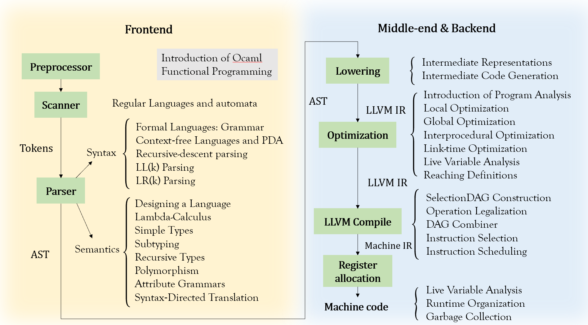


# Lecture 1: Introduction of Compiling


## 引入

- Example1:

```c
signed char a;
unsigned int b;
a = -20;
b = 10;
if(a < b) printf("a < b\n");
else printf("a >= b\n");
```

利用语法树进行分析，涉及到C语言自动类型转换。

- Example2:

```c
double Girth1(double r){
	return 6.2831852 * r;
}
double Girth2(double r){
	const double PI = 3.1415926;
	return 2 * PI * r;
}
```

第二个更好，常量 `PI` 是局部的，编译器通常会优化掉这部分，所以性能上基本一致，第二个可读性占优。

- Example3：

```
int atoi(char *str){
	...
	return ...;
}
int atoi(const char *str){
	...
	return ...;
}
```

传递给函数的字符串不会被修改。这样可以避免无意间改变原始数据，也使代码更安全。从编译的角度可以提供更多的优化空间，也不会导致程序变得复杂。包括像`volatile`也应该注明。


## 课程内容

1. 函数式编程
2. 程序间的翻译：这是广义上的编译。
3. 程序分析与优化


## 软件编译流程

**预处理器（Preprocessor）**

- **作用**：预处理器负责处理宏定义、条件编译指令等，把字符串替换为其他字符串。这些操作发生在编译过程的最开始。
- **例子**：如 `#include`、`#define` 指令等。

**扫描器（Scanner） / 词法分析器（Lexical Analyzer）**

- **作用**：扫描器将源代码（字符串）转换为一系列的“标记”（tokens），每个标记代表一个基本的语法单位，比如关键字、标识符、运算符等。
- **例子**：将代码 `std::wcout << L"Hello world!"` 转换为对应的标记序列。

**解析器（Parser） / 语法分析器（Syntax Analyzer）**

- **作用**：解析器对扫描器生成的标记序列进行分析，检查语法结构并**生成语法树**（抽象语法树），同时还会**进行语义检查，比如类型检查**。
- **例子**：对于 `int main()`，解析器会检查语法结构并生成对应的语法树。

**代码生成器（Code Generator）**

- **作用**：代码生成器将解析器输出的语法树转换为**中间代码**。
- **例子**：将高级语言的代码转化为低级的汇编代码或机器码。

**优化器（Optimizer）**

- **作用**：优化器通过各种技术优化中间代码，提升代码的执行效率，减少内存消耗。
- **例子**：将不必要的计算移除，或者通过循环优化提高程序效率。**位于整个编译流程之中。**

**目标代码生成器（Target Code Generator）**

- **作用**：目标代码生成器将最终的中间代码转化为**机器码**（目标代码），即程序可以被计算机执行的代码。考虑硬件细节（Hardware Details），需要考虑寄存器分配、内存布局、指令格式等底层硬件细节。

  

## 硬件编译流程

存在**HLS（High-Level Synthesis）** 和 **LLS（Low-Level Synthesis）** 的概念。

- **HLS：** **高级代码（C/C++）** → **中间表示（IR）** → **硬件描述语言（HDL）**
-  **LLS**：**硬件描述语言（HDL）** → **门级网表（Gate-Level Netlist）** → **布线和布局（Place and Route）** → **比特流（Bitstream）**


# Lecture 2: Introduction of OCaml

## OCaml特征

- **强类型（Strong Typing）**：和C、C++不同的重要一点，OCaml不会进行隐式类型转换。
- **静态类型检查和推理（Static Type Checking and Inference）**：静态检查意味着在编译的时候确定变量类型，但是因为有强大的推理系统，所以一般不需要显式声明变量类型，可以自动推出，相当于C++中的`auto`。

- **函数是一等公民（First-Class Functions）**：可以像处理数据（普通变量）一样处理函数，函数可以作为参数传递，也可以作为返回值。
- **泛型编程（Generic Programming）**：存在类型通用的函数，例如`let identity x = x;;`。利用`'a`这种占位符。
- **代数数据类型（Algebraic Data Types, ADT）**：就是变体类型（variant type）
- **模式匹配（Pattern Matching）**：允许在函数中根据数据的不同形态来进行分支选择。模式匹配特别适用于代数数据类型。

## OCaml历史

- ML：是LCF（Logic for Computable Functions）证明助手的元语言。
- Caml：基于一个快速、顺序的垃圾回收器的字节码解释器，构建了一个新的实现。可以实现对指针的自动回收。
- OCaml：实现了功能强大且优雅的面向对象系统

## OCaml应用

- 特别适用于分布式系统：OCaml是一种函数式编程语言，强调不可变性（immutability）和无副作用（pure functions）。这意味着在OCaml中，变量一旦绑定，就不能修改其值，这使得全局变量的修改变得不那么常见，因此与分布式系统非常契合。
- 适用于数学证明领域：因为函数式编程的核心思想是函数的纯粹性，即函数的输出仅依赖于输入，没有外部的副作用，所以在数学证明中，使用OCaml描述算法或数据结构时，证明其正确性相对容易。

## 环境搭建

- WSL安装
- 安装OCaml：https://ocaml.org/install#win
- 在线运行环境：https://try.ocamlpro.com/
- 编程练习题：https://ocaml.org/exercises

## 编译与运行

### 交互模式（Read-Eval-Print Loop，REPL）

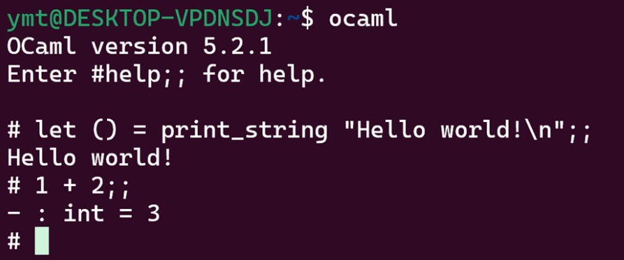


### 程序模式

- 编译运行

```bash
$ ocamlopt -o hello.out hello.ml
$ ./hello.out
```

- 解释运行

```bash
$ ocaml main.ml
```

- dune和cmake文件类似。

## 基本语法与理解

### 基本输出函数

- `print_int;`
- `print_string;`
- `print_float`
- `print_newline ()`
- ` print_endline`..


### 基本运算

```ocaml
let rem = 10 mod 3         (*整数求余*)
let fpow = 2.0 ** 3.0      (*浮点乘方*)
let eq = 3 = 3             (*等于判定*)
let neq = 3 <> 4           (*不等于判定*)
let and_op = true && false (*逻辑与*)
let or_op = true || false  (* 逻辑或 *)
let not_op = not true      (* 逻辑非 *)
```

- functional programming：everything is function!

```ocaml
# let operator = function
    | "+" -> ( + )
    | "-" -> ( - )
    | "*" -> ( * )
    | "/" -> ( / )
    | _ -> failwith "error" ;;
val operator : string -> int -> int -> int = <fun>
# let op = operator "/" ;;
val op : int -> int -> int = <fun>
# op 6 4 ;;
- : int = 1
```


### Bind绑定

- `let a = b;; `

- `let x = 1 in x + 9;;`

- `let () = print_string "aaa";;`

### function函数

高阶函数（higher-order functions）是指接受函数作为参数或返回函数的函数。

- **let关键词创建函数**
  - `let func x y = x + y;;`
  
  - `let func  x y = (float_of_int x) +. y;;`  说明：因为强类型，需要利用`float_of_int`将`int`转换为`float`，注意有下划线。` func `有两个参数`x`和`y`，按照《离散数学》中的结构应该表示为`int * float -> float`，称之为`uncurried form`。在函数式语言中采用嵌套函数的方法定义，即`int -> float -> float`，称之为`curried form`。因此，`func 2;;`的返回结果是` - : float -> float = <fun>`。
- **fun关键词创建匿名函数**（匿名函数，也称为lambda函数）
  - (fun x -> x + 2) 3;;
  - 一般用在仅使用一次的函数（如上），也可以再绑定，如：`let func = fun x -> x + 2;;`
- **function关键词**: 在后续模式匹配的部分详细讲解。他只允许一个参数的模式匹配。

### **if-else关键词**

```ocaml
let is_even =
	if n mod 2 = 0 then true (* n 是偶数 *)
	else false               (* n 是奇数 *)
```


## tuple元组

```ocaml
# let x = (2, 3.2) ;;
val x : int * float = (2, 3.2)
# fst x ;;
- : int = 2
# snd x ;;
- : float = 3.2
```


## records记录

```ocaml
# type person = {name: string; age: int} ;;
type person = { name : string; age : int; }
# let x = {name = "lucy"; age = 20} ;;
val x : person = {name = "lucy"; age = 20}
# x.name ;;
- : string = "lucy"
```


## variant type 变体类型

```ocaml
type new_type1 = Int of int | () ;;
# type new_type1 = Int of int | ()
type new_type2 = Float of float | Unit ;;
# type new_type2 = Float of float | Unit
let x = Int 2 ;;
# val x : new_type1 = Int 2
let y = Float 1.0 ;;
# val y : new_type2 = Float 1.
let z = Unit ;;
# val z : new_type2 = Unit
let w = () ;;
# val w : new_type1 = ()
let z : new_type1 = () ;;
# val z : new_type1 = ()
```


# Lecture3: Functional Programming


## 函数式语言特点

- **纯函数语言没有副作用**，OCaml引入了print_string等有副作用的函数方便编程。
- **函数是一等公民。**
- **函数的作用是将值和值之间进行绑定。**
- **优势**：可读性（Readability）；并行性（Parallelism）；组合性（Compositionality），鼓励通过小的、纯粹的函数来构建更复杂的程序；声明式风格（Declarative Style），描述“做什么”而不是“怎么做”。
- **劣势**：学习曲线（Learning Curve）、性能（Performance）、调试（Debugging）。

- **图灵**（Alan Turing）和 **丘奇**（Alonzo Church）分别创建了函数式语言和过程式语言，后续理论证明了**图灵机**与**λ演算（Lambda Calculus）**的等价性。


## Pattern Matching 模式匹配

```ocaml
# let is_even num = 
    let signal = num mod 2 in 
    match signal with
      1 -> 0
    | 0 -> 1
    | _ -> -1 ;;  (*Default Pattern*)
val is_even : int -> int = <fun>
```

- 利用模式匹配，结合递归函数求取列表最大项：

```ocaml
# let rec list_max x = 
    match x with
      [] -> failwith "Empty"
    | [x] -> x
    | x :: y -> max x (list_max y) ;;
val list_max : 'a list -> 'a = <fun>     (*generic type example*)
# list_max [22.3;332.;3.] ;;
- : float = 332.
```

- 求取列表长度：

```ocaml
# let rec list_length input =    (*not tail recursive*)
    match input with
      [] -> 0
    | [x] -> 1
    | x :: y -> (list_length y) + 1 ;;
val list_length : 'a list -> int = <fun>
# list_length [0;1;2;3;4;5] ;;
- : int = 6

# let rec list_length_tail input cal = ()     (*tail recursive but not good*)
    match input with
      [] -> 0
    | [x] -> cal + 1
    | x :: y -> list_length_tail y (cal + 1) ;;
val list_length_tail : 'a list -> int -> int = <fun>
# list_length_tail [0;1;2;3;4;5] 0 ;;
- : int = 6

# let rec list_length_tail_fix input cal =      (*good example*)
    match input with
      [] -> cal
    | _ :: y -> list_length_tail_fix y (cal + 1) ;;
val list_length_tail_fix : 'a list -> int -> int = <fun>
# list_length_tail_fix [0;1;2;3;4;5] 0 ;;
- : int = 6

# let rec list_length_tail_wrapped input =      (*wrapped example*)
    let innerfunc input cal =
      match input with
        [] -> cal
      | _ :: y -> list_length_tail_fix y (cal + 1)
    in innerfunc input 0 ;;
val list_length_tail_wrapped : 'a list -> int = <fun>
# list_length_tail_wrapped [0;1;2;3;4;5] ;;
- : int = 6
```


## Recursive function递归函数

```ocaml
let rec fib n =
  if n = 0 then 0
  else if n = 1 then 1
  else fib (n - 1) + fib (n - 2);;
```

- 注意：if后面没有分号；

- 为了避免堆栈溢出（stack overflow），编程最好采用**尾递归**，即函数的最后一次操作是递归操作，因为编译器可以将尾递归的实现变为迭代（Tail Call Optimization）。像上面的斐波那契算法就不属于尾递归。

- 可以用`[@tailcall]`实现检查，在函数实现时，类似这样调用`fact [@tailcall] (x - 1)`。


## Tail Recursive Transformation

- 一般引入多余变量
- 阶乘实现：

```ocaml
let rec fact x =
  if x = 0 then 1
  else x * (fact [@tailcall] (x - 1));;
let rec fact x acc =
  if x = 0 then acc
  else fact (x - 1) (x * acc);;
```

- 斐波那契实现：

```ocaml
let rec fib_tail n a b =
  if n = 0 then a
  else if n = 1 then b
  else fib_tail (n - 1) b (a + b);;

let fib n = fib_tail n 0 1;;
```


## List列表

```ocaml
# let x = [1; 2] ;;
val x : int list = [1; 2]
# let x = 1 :: x ;;
val x : int list = [1; 1; 2]
# let x = [5; 6] @ x ;;
val x : int list = [5; 6; 1; 1; 2]
# x ;;
- : int list = [5; 6; 1; 1; 2]
```

- `::`代表拼接一个元素和一个列表，`@`表示拼接两个列表。
- 注意：列表元素间用分号相隔，这和元组不同。
- 本代码的逻辑是x不断解绑和重绑，不能理解为赋值。

- 可以使用`List`模块：` List.length lst;;  List.hd lst;;  List.tl lst;;  List.rev lst;;  List.sort compare lst;;  List.mem 2 [3;2;4];;`

- `List`模块也存在一些高阶函数的库，如下：

```ocaml
# List.map2 (+) [1;2;3] [2;2;3] ;;       (*高阶函数示例*)
- : int list = [3; 4; 6]
# List.iter print_string ["lala\n";"haha\n";"mama\n"] ;;          (*高阶函数示例*)
lala
haha
mama
- : unit = ()
# List.filter (fun x -> x mod 2 = 1) [1;2;3;4] ;;             (*高阶函数示例*)
- : int list = [1; 3]
# List.fold_left (+) 0 [1;2;3;4;5];;
- : int = 15
# let rec my_fold_left (func: int -> 'b -> int) num lst =             (*重写函数，注意可以约束函数类型*)
    match lst with
      [] -> num
    | h :: t -> my_fold_left func (func num h) t ;;
val my_fold_left : (int -> 'b -> int) -> int -> 'b list -> int = <fun>
```

## 高阶函数

- **高阶函数**：高阶函数是指接受其他函数作为参数，或者返回一个函数的函数。

```ocaml
# let rec map func lst = 
    match lst with
      [] -> []
    | h :: t -> (func h) :: (map func t) ;;
val map : ('a -> 'b) -> 'a list -> 'b list = <fun>
# let double x = x * 2 ;;
val double : int -> int = <fun>
# map double [1;3;5] ;;
- : int list = [2; 6; 10]
```


# Lecture 4: Formal Languages


- **形式语言**：syntax（**语法**）和semantics （**语义**）严格定义的语言。本质上形式语言就是一个string set（**字符串**组），字符从alphabet （**字符表**）选取，按照一定的规则组合而成。从本节开始，将讲解如何构造语言。

## 定义重要概念解释

### 字符表

- 非空有限集，元素称为符号。比如，汇编语言的字符表是{0,1}。

### 字符串

- $\epsilon $ 是空串，$|\epsilon |$ 是串的长度
- 连接操作（Concatenation）：$\alpha \cdot \beta$或者$\alpha \beta$. 进而递归定义串的幂。

```ocaml
let rec cat s1 s2 = s1 ^ s2;;
let s1 = "hello";;
let s2 = " world";;
cat s1 s2;;
```

### 集合

- 乘法操作（Multiplication）：$AB=\left\{ \alpha \beta | \alpha \in A,\beta \in B\right\}$ ,进而定义了集合乘法的幂；
- 克林闭包（Kleene star or Kleene closure）：$A^{\ast }=A^{0}\cup A^{1}\cup A^{2}\cup A^{3}\ldots$. 
- Kleene plus:  $A^{+}=A \cdot A^{\ast }$  相较于前者，在A非空的情况下， $A^{+}$不包括空串。

### 语言的本质

- 语言$L$是字符串的集合；
- $\sum^{*}$表示字符表符号组成的任意字符串集合;
- 因此，$L\subseteq \Sigma ^{\ast }$


## 文法Grammar

### 定义

- 判定字符串集合是否符合规定，即合法（Valid or Well-formed）;
- 文法被定义为一个元组$G=\left( V_{N},V_{T},P,S\right)$.
  - **$V_N$** 是一组**非终结符（Nonterminal symbols）**：这些符号表示语言的结构部分，是文法中的抽象符号，不能出现在语言的最终输出中。
  - **$V_T$** 是一组**终结符（Terminal symbols）**：这些符号是语言的基础构件，是文法生成的最基本单元，**最终会出现在源代码或者程序中**。例如，在 C 语言中，`+`, `-`, `if`, `else` 等都是终结符。
  - **$P$** 是一组**产生式规则（Production rules）**：它们定义了如何将非终结符替换成其他符号（包括终结符和/或其他非终结符）。每条规则的**左侧是非终结符**，右侧是**可以替换的符号串**。
  - **$S$** 是**起始符号（Start symbol）**：它是文法中的一个非终结符，表示整个语言结构的起始点，也就是解析的起点。
- 文法生成的语言一般记作$L(G)$ 

### 语法树

- 树的结构当中，根节点是$S$，叶子节点是终结符，其他节点都是非终结符。
- 合法的字符串，匹配有一个对应的语法树，从树的叶子节点自左到右依次阅读，这就是完整的字符串表达式。

### 文法类型

- **Type-0**（无条件文法）：可以生成任何递归可枚举语言（Recursively enumerable languages）.

- **Type-1**（上下文相关文法）：$βAγ→βαγ$.

- **Type-2**（**上下文无关文法，CFG**）：是**编程语言和大部分计算机语言的核心**，常用于编译器.

- **Type-3**（**正则文法**）：𝐴 → 𝑎𝐴 or 𝐴 →𝑎. 最简单，适用于简单的模式匹配和词法分析.

### 举例分析

- 文法$G[E]$:

  - $E→E+T∣T$

  - $T \rightarrow T * F \mid F$

  - $F \rightarrow (E) \mid i$
  - 本例实现了运算的相关文法。可以设想，如果不涉及括号改变优先级。第三个产生是不需要有。优先级越高的在文法当中，应更靠后实现。

- 一个语法树举例:

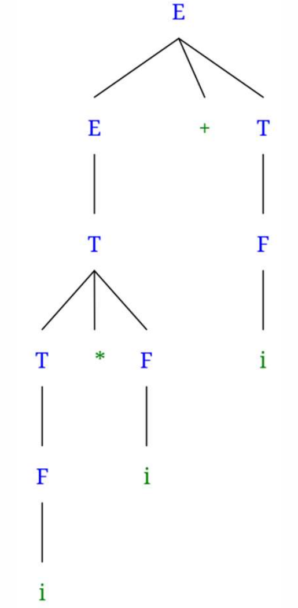

### 歧义文法（Ambiguous Grammar）

- 歧义文法是指在**上下文无关文法**中存在一个字符串，这个字符串可以通过多种方式推导，生成**多个语法树**。
- 一个典型的问题是**悬挂的 `else` 问题（Dangling Else）**
  - *G[S]=if  B  S  |  if  B  if  B  S  else  S*, 这种原始的文法会导致*"if  B  if  B  i  else  i"*产生两种不同的语法树。
  - 一种解决方案是引入两个状态位:
    - 𝑆 → 𝑚𝑎𝑡𝑐ℎ𝑒𝑑 | 𝑢𝑛𝑚𝑎𝑡𝑐ℎ𝑒𝑑 
    - 𝑚𝑎𝑡𝑐ℎ𝑒𝑑 → 𝑖𝑓 𝐵 𝑚𝑎𝑡𝑐ℎ𝑒𝑑 𝑒𝑙𝑠𝑒 𝑚𝑎𝑡𝑐ℎ𝑒𝑑 | 𝑖 
    - 𝑢𝑛𝑚𝑎𝑡𝑐ℎ𝑒𝑑 → 𝑖𝑓 𝐵 𝑆 | 𝑖𝑓 𝐵 𝑡ℎ𝑒𝑛 𝑚𝑎𝑡𝑐ℎ𝑒𝑑 𝑒𝑙𝑠𝑒 𝑢𝑛𝑚𝑎𝑡𝑐ℎ𝑒*d*


## 练习题($\sum =\left\{ 0,1\right\}$)

### L={ω∣ω contains at least two “1”s. }

- G[S]: 
  - S → T1T; 
  - T → P1P; 
  - P → 0P | 1P |  ϵ.

### L={ω∣ω starts and ends with the same symbol. }

- G[S]: 
  - S → 1T1 | 0T0;
  - T → 0T | 1T | ϵ.

### L={ω∣ω has the same number of “0”s and “1”s. }

- G[S]: 
  - S → 0A | 1B | ϵ;
  - A → 1S | 0AA;
  - B → 0S | 1BB.

### L={ω∣ The number of 1s in ω is more than that of 0s. }

- G[S]: 
  - S -> T1T;
  - T -> T1T | S0T | T0S | ϵ;

任何一个，可以用我的文法定义，但是我的文法不一定能保证唯一性

### L= the complement set of {$  { 0^n 1^n | n >=0 } $}

- G[S]: 
  - S -> 0S1 | 1T | T0;
  - T -> 1T | 0T | ϵ;

### 做题思路

- 划分状态，找到出口。
- 保证全面性。


# Lecture 5: Regular Languages


## Regular Languages（正则语言）

- 正则语言是计算机科学中最简单的一类**形式语言**（Formal Languages），它们可以被**有限状态自动机（Finite State Automata, FSA）** 识别，并且可以用**正则表达式（Regular Expressions）** 描述。
- 在编译原理中，是词法分析器的作用，处理的是一个变量应该如何命名的问题。如：C语言中，标识符规则为`[a-zA-Z_][a-zA-Z0-9_]*`.

- 三种等价的表述：
  - Finite State Automata（有限状态自动机, FSA）
  - Regular Expressions（正则表达式）
  - Regular Grammars（正则文法）

## Finite State Automata（有限状态自动机, FSA）

### 状态机流程

- 只有一个变量，且变量的值有限，不同的值代表着不同的**状态**（state）；
- 根据当前的状态和输入（input），系统状态进行**更新**（update）
- 一旦输入全部完成，判定是否属于**可接受状态**（accepting state）。

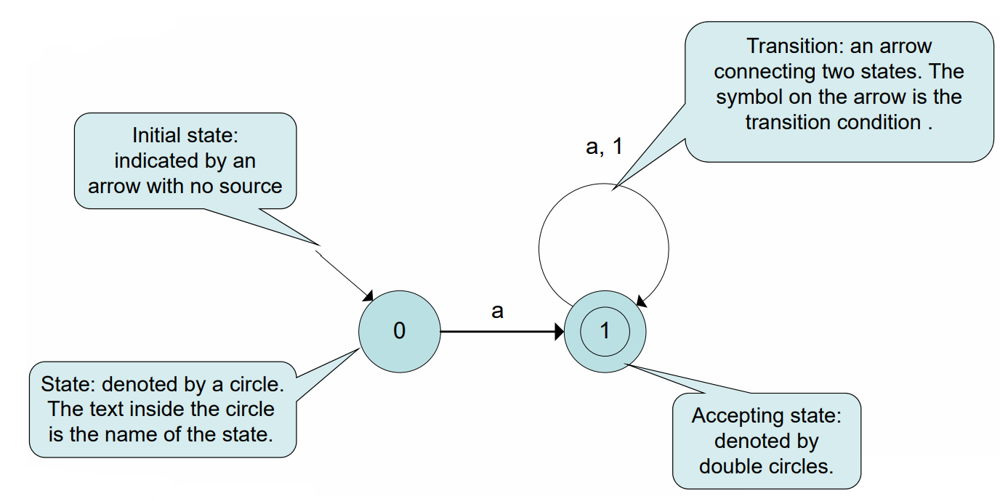

### 有限状态机的分类

- Deterministic automata (DFA)：如上图所示，不允许发生空转移和多次转移。

- Nondeterministic automata (NFA)：允许发生空转移和多次转移。

### DFA数学描述

- 五元组$M=(Q,Σ,δ,q_0,F)$
  - $Q$ 是有限状态集合（Finite Set of States）
  - $\Sigma$ 是输入符号集合（Alphabet）
  - $δ$ 是状态转换函数（Transition Function）$δ:Q×Σ→Q$
  - $q_0 $是初始状态（Initial State）
  - $F$ 是接受状态集合（Final/Accepting States）
  - 可见统共有四个集合和一个状态来描述
- 每次执行称之为一个**运行（Run）** 
- 如果一个字符串在有限自动机$ M $运行后最终停在一个接受状态，那么这个字符串属于$L(M)$, 说明这种语言可以被自动机识别，也就等价于这个语言是正则的。

### NFA数学描述

- 依然类似于上述的五元组，只不过在这里需要调整输入符号集合。$\delta: Q \times \Sigma_\epsilon \rightarrow 2^Q   $,$\Sigma_\epsilon = \Sigma \cup \{\epsilon\}$. 
- 下图所示的分支可以理解为进程的fork:

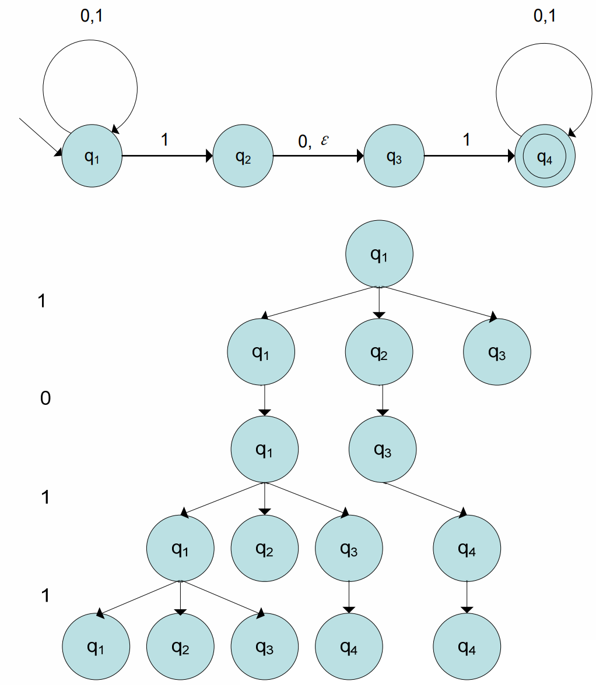

- 事实上只要将上图的每一行合成为一个元组，那么$NFA$和$DFA$就是等价的。

### 自动机的组合

#### 并集理论

- 如果两个语言是正则的，那么他们的并集是正则的。
- 该定理意味着我们可以通过组合简单自动机来构建大型自动机来识别复杂的语言。
- 比如说在计算机系统的词法分析过程当中，存在标识符、关键词等等。可以针对于不同的词语进行分析并创建自动机，再将多个自动机进行并集处理。

#### 连接理论

- 如果两个语言是正则的，那么他们的连接是正则的。
- 只需要在前者的接受状态引出一个空转移（𝜖-transition），到后者的起始状态即可。

### 练习1

- $L_1 = \{ z \mid z \text{ starts with "101"} \}$
- $L_2 = \{ z \mid z \text{ z contains the substring "01"} \}$ 
- $L_3 = \{ z \mid z \text{ is a valid octal number} \}$
- $L_4 = \{ z \mid z \text{ is a valid hexadecimal number} \}$

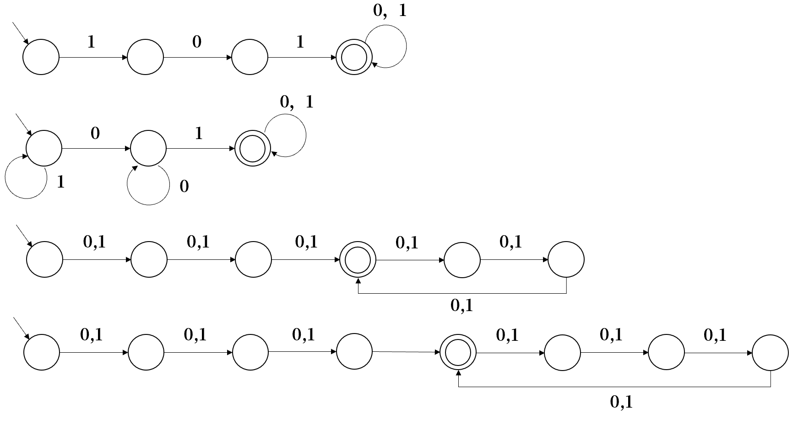

### 练习2

- NFA 转化为 DFA

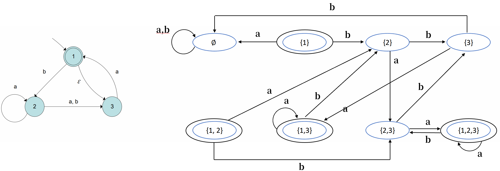

- 针对三个NFA状态，引入$2^3$个


## 正则表达式（Regular expression）

### 定义

- $R$是正则表达式，$L(R)$是通过下面定义的语言：
  - $L(a) = \{ a \}$
  - $L(\epsilon) = \{ \epsilon \}$
  - $L(\emptyset) = \emptyset$
  - $L(R_1 + R_2) = L(R_1) \cup L(R_2)$
  - $L(R_1 \cdot R_2) = L(R_1) \cdot L(R_2)$
  - $L(R_1^*) = L(R_1)^*$


### 和前述FSA的等价性证明与构造

- **汤普森构造法**（Thompson's Construction）

- 归纳基础：当$R=a, R=\epsilon,R=\emptyset$时，可以很方便的构造。

- 归纳步骤：

  - $R_1 + R_2$：

    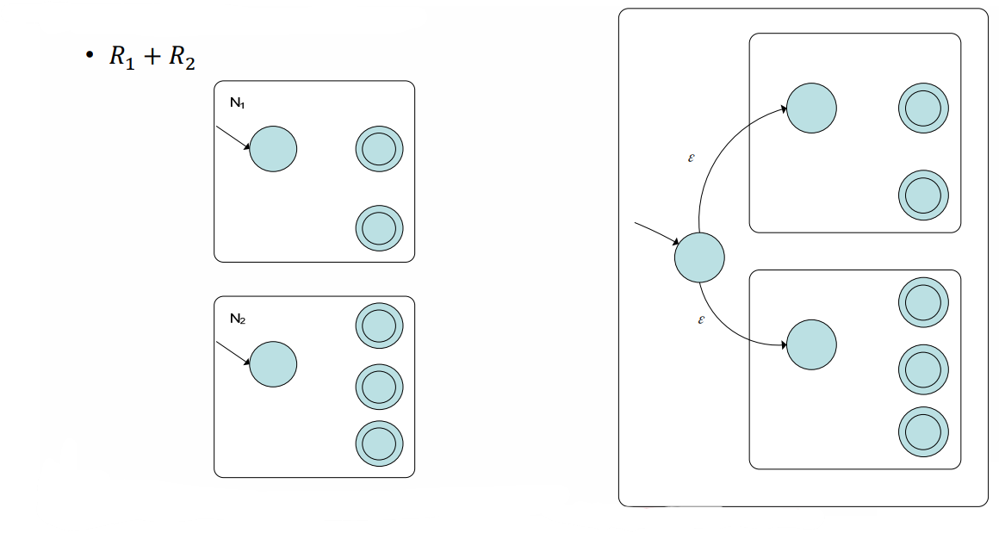

  - $R_1 \cdot R_2$：

    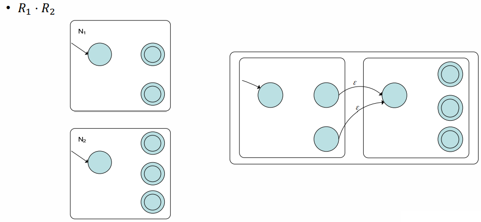

  - $R_1^*$：

    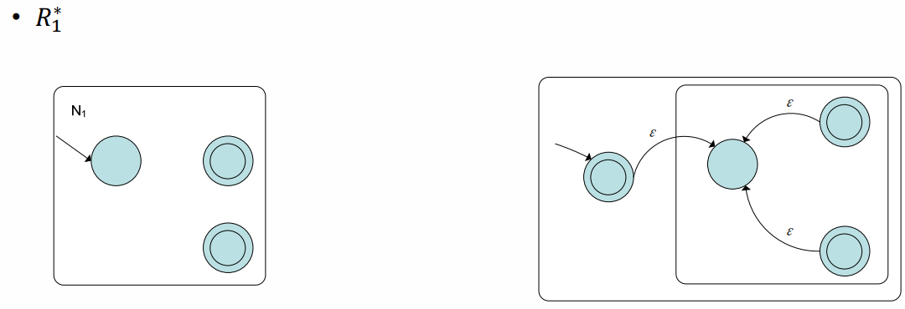

## 完整词法分析器（Scanner or Lexer）设计思路

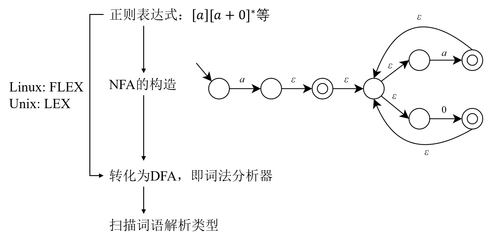

- 注：假设NFS有$n$个状态，$m$个输入，意味着这些状态组成集合的幂集元素共$2^n$个，即DFS状态有$2^n$个。每一个DFS状态都有针对$m$个不同输入的映射。所以上述案例手绘比较复杂。

## OCaml程序设计

```ocaml
(*String that contains 010, ends with $*)

type status = Q0 | Q1 | Q2 | Q3 | Dead;;
let convert_to_list str =
  String.fold_right (fun x acc -> x :: acc) str [];;

let move_status input_bit status = 
  match (input_bit, status) with 
    ('0', Q0) -> Q1
  | ('1', Q1) -> Q2
  | ('0', Q2) -> Q3
  | (_, Q3) -> Q3
  | _ -> Dead;;

let check_if_correct status =
  match status with 
    Q3 -> true
  | _ -> false;;


let rec fsm_inner lst status = 
  match lst with
    ['$'] -> check_if_correct status
  | h :: t -> fsm_inner t (move_status h status);;


let fsm_run input = fsm_inner (convert_to_list input) Q0;;

fsm_run "0101$";;
```


# Lecture 6: Context‐free Languages


## 语法分析器

- 主要任务：
  - **检查源代码（一般语言都是上下文无关类型CFL）是否符合语言的语法规则**
  - **生成一个语法树**（通常是 **抽象语法树**，AST）
  - **语义检查**
  - **类型检查**
  
- PDA 在语法分析中的作用：PDA 能够 **识别输入是否符合文法规则**，这意味着它能确定源代码是否符合编程语言的语法规范。
- 词法、语法和文法的区别
  - **词法**是关注单个符号（token）的定义和识别； Lecture5的主要内容。
  - **文法**定义了如何用这些符号按照一定规则构建有效的句子或结构；Lecture4的主要内容。
  - **语法**就是这些文法规则在实际应用中的检查，确保输入符合语法要求。Lecture6的主要内容。


## 下推自动机Pushdown automata (PDA)

### PDA概念

- 下推自动机是一种具有堆栈的状态机。
- 可以识别（解析，parse）上下文无关的语言。
- PDA 是非确定性的（Nondeterminism）


### PDA数学表达

- 在一般的自动机的基础上定义六元组$M=(Q,Σ,Γ,q_0,δ,F)$
  - **Γ**：是栈字母表，表示 PDA 栈中可能出现的符号。
  - $\delta: Q \times \Sigma_\epsilon \times \Gamma_\epsilon \to \mathcal{P}(Q \times \Gamma_\epsilon)$ 
- PDA流程说明：相较于之前的FSA，在PDA中，fork新的复制品后，需要**各自**维护栈资源。


### **自顶向下解析**（Top-Down Parsing）

- 通俗来说，就是从一个起始符号$S$开始不断地分化、创建(fork)，直到获得目标的表达式。如果在所有可能性中能够找到一个匹配目标的表达式，则代表成功，否则失败。

- $𝐺_1[𝑆] : 𝑆 → 0𝑆1 | 01$

  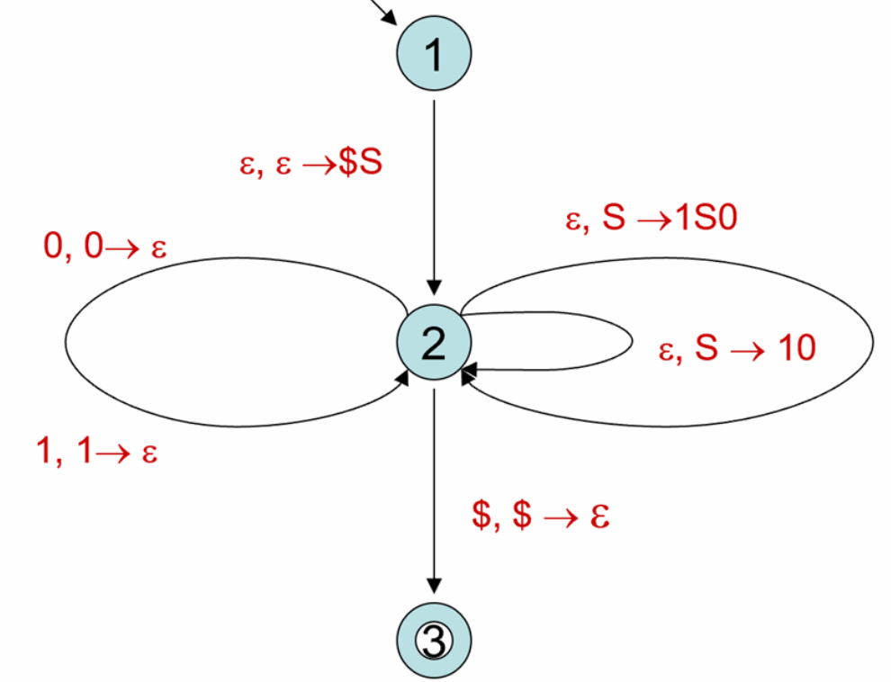

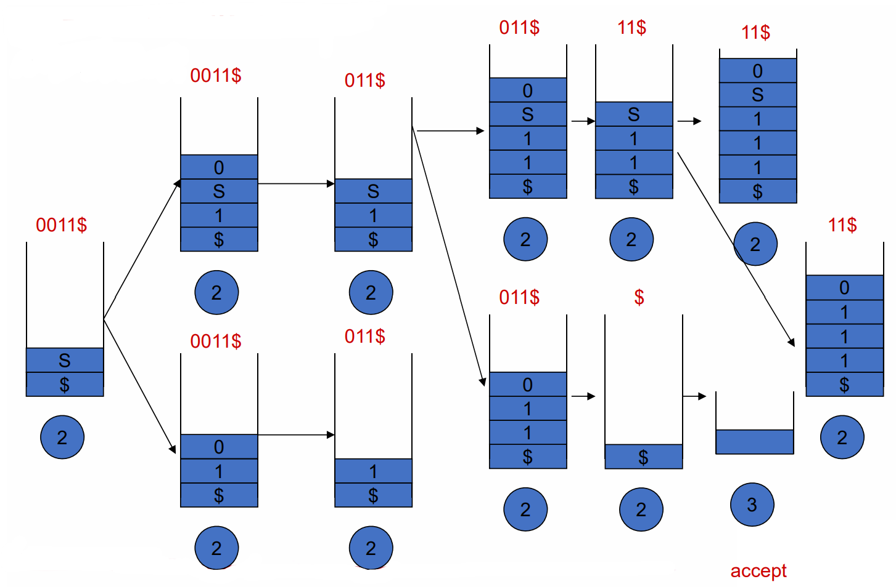


## OCaml程序设计

- 如上图所示的完整流程设计如下：

```ocaml
let convert_to_list str =
  String.fold_right (fun x acc -> x :: acc) str [];;

let check_if_correct stack =
  match stack with
    ['$'] -> true
  | _ -> false;;

let rec fsm_inner lst stack =
  match lst, stack with
    ['$'], _ -> check_if_correct stack
  | h1 :: t1, h2 :: t2 ->
      match h1, h2 with
      | '1', '1' -> fsm_inner t1 t2
      | '0', '0' -> fsm_inner t1 t2
      | '1', '0' -> false
      | '0', '1' -> false
      | _, 's' -> fsm_inner lst ('0' :: '1' :: t2) || fsm_inner lst ('0' :: 's' :: '1' :: t2)
      | _, _ -> false;;

let fsm_run input = fsm_inner (convert_to_list input) ['s'; '$'];;

fsm_run "01011$";;
```


# Lecture 7: Designing a Toy Language


## 语法分析器的整体思路

- Syntax（语法）：判定字符串是不是合法的（well-formed），主要是前面的下推自动机和文法。这里面我们主要利用BNF（巴科斯-诺尔范式，Backus-Naur Form）表达。
- Semantics（语义）：确定了语句的意思，可以理解为，语法是设计者自己定义的，但是一个好的语法都应该确保一个字符串有唯一的理解方式，也即化简的结果唯一。
- Type（类型）：主要是为了解决stuckness（卡住）的问题，比如`succ false`这种虽然符合格式要求，但是没有一个确定值的问题。


## Toy Language(玩具语言)设计

### 引入布尔变量

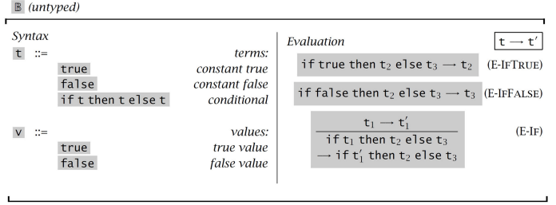

- 左侧是语法部分，`t`代表着表达式的形式，`v`代表着最终化简结果。这部分只关心形式的正确性。
- 右侧是语义部分，也就是一些推导规则。在具体推导过程中，要代入具体表达式到`ti`上面，也即“实例（Instance）”
- 箭头是一步推导的意思（称左右式可推导的，deivable），横线代表推导规则（Inference Rules），可以理解为推导规则是在原有的一步推导基础上，加上一些共有的结构。
- 引入推导：例如E-IFTRUE，不是推导规则。在一步推导开始时引入。（这是自己定义的说法）

### 引入自然数

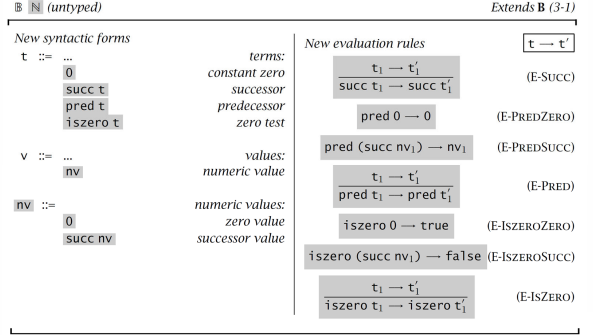

- 举例说明：Evaluate `pred(succ(pred 0))`in one step.

  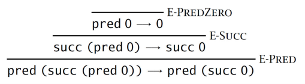

  - 特别说明，这个示例是一步的推导，后面还可以利用E-PREDSUCC进行进一步的化简。如果在类型正确的情况下，依然无法推导出最终的结果，那就说明Evaluation的推导表达式并不全面。、


### 如何评价语法设计

#### 名词说明

- **Normal Form（正规形式）**：$t$处于正规形式，当没有任何求值规则可以进一步应用。换句话说，它是无法再被化简的最终状态。
- Multi-step evaluation（多步求值）：这里的$\to$表示多步求值关系，即从$t$经过若干步转换，最终达到某个状态。

#### One-step evaluation determinacy（单步求值确定性）

- 如果$t \to t'$ 且$t \to t''$ ，则$t'= t''$ 。
- 每次求值操作的唯一性，保证单步操作过程中不会产生分歧。

#### Uniqueness of Normal Forms（正规形式的唯一性）

- 如果$t \to^* u$且$t \to^* u'$，并且$u$ 和 $ u'$ 都是正规形式，则$ u=u'$。
- 这意味着一个表达式在不同的求值路径下得到的结果应该相同，否则会导致程序的不可预测性。

#### **Termination of Evaluation（求值终止性）**

- 对于每个项$t$，都存在某个正规形式 $t'$，使得 $t \to^* t'$。
- 这个定理意味着求值过程一定会终止，不会出现无限循环或非终止求值。


# Lecture 8: Lambda-Calculus


- 这部分的定位是：继续丰富了语义的部分，可以定义函数式编程的函数，也是后边类型系统的基础。

## Lambda演算的语法形态

- t ::=
  - x        (variable)
  - λx.t    (abstraction)
  - t t       (application)

- 运算顺序说明：默认左结合。` λx.λy.x y x = λx.(λy.((x y) x))`是函数定义，如果是应用，则应该在外侧加上括号，如`（λx.λy.x y x) 1 2`。

- 特别地，`(λx.x)`可以写成`id`。

## Beta Reduction（β-化简）

- `redex` 是 **"reducible expression"（可归约表达式）** 的缩写，它指的是可以被化简的 Lambda 表达式

### Full beta-reduction（完全的beta化简）

- 在完全的beta化简中，任何 `redex`（可归约表达式）都可以在任何时间进行化简。换句话说，只要一个表达式符合化简条件，它就可以被替换掉。
- 一般情况下从内到外，依次化简。

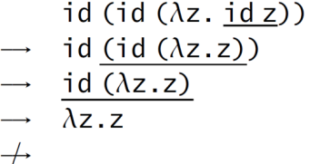

### Normal order strategy（正常顺序策略）

- 它始终从最左侧的表达式开始化简，优先化简最外层的 `redex`。

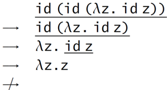

### Call by name strategy（按名称传递策略）

- 函数的参数会延迟求值，直到在函数体内使用该参数时才会求值。

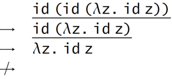

###  **Call by value strategy（按值传递策略）**

- 按值传递意味着只有当函数参数已经被计算为最终值时，才会进行函数应用。
- 相比之下，像 **按名称传递** 和 **按需求传递** 等**惰性求值策略**，只在实际需要时才会计算参数，能更好地避免递归或无限计算导致的问题。

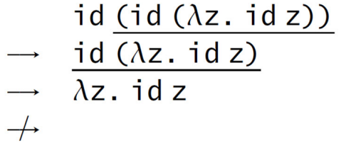


# Lecture 9: Simple Types


## 类型系统的引入

- 为了解决stuckness的运行时错误，如：`succ false`这种类型不匹配，可以通过引入类型系统，实现静态检测。

## Typing relation（类型推导关系）

- Assigning terms to types.  `t:T (or t∈T)`

### 引入布尔变量的类型系统

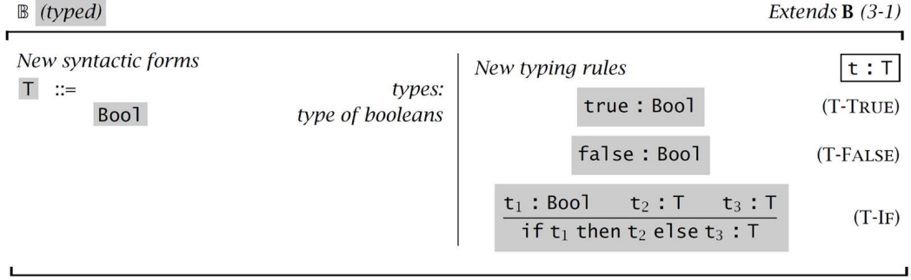

- 相比于先前的逻辑（`t` 代表可能出现的表达式形式，`v`表示可能出现的所有终止符），这里进行了扩充，引入了`T`作为类型，而各函数的类型对应关系在Typing rules中说明。

### 引入自然数的类型系统

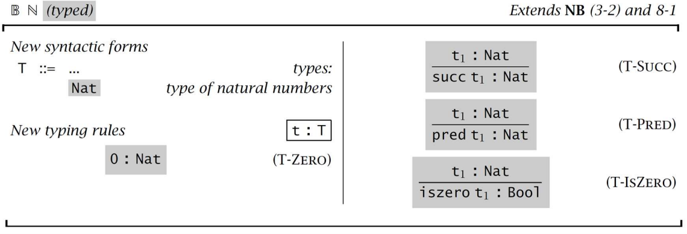

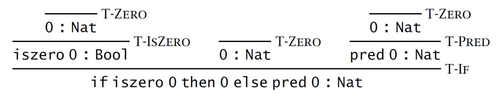

- 手动分析，可以从结论向前推导。


## 如何评价类型推导关系

### 设计时类型的唯一性

- 定理1：类型的唯一性
  - 该定理断言，每个术语（表达式）`t` 在语言中最多只有一种类型。它保证了在该语言的规则下，没有术语可以拥有多种类型。

### 安全性

- **安全性**（Safety）以及它的组成部分：**进度（Progress，A well-typed term is not stuck）**和**保持（Preservation，If a well-typed term takes a step of evaluation, then the resulting term is also well typed）**

- 定理2：Progress
  - Suppose t is a well-typed term (that is, t:T for some T). Then either t is a value or else there is some t’ with t→t’.
- 定理3：Preservation
  - If t:T and t→t’, then t’:T.


## Simply Typed Lambda-Calculus

- 向前面讲解的Lambda-Calculus加入类型系统。

### 类型注解（type annotation）

- **显式类型语言(explicitly typed)：**要求在表达式中使用类型注解来指导类型检查器。

- **隐式类型语言(implicitly typed)**：依赖类型检查器自动推断或重构类型信息。

### Lambda演算的类型系统概述

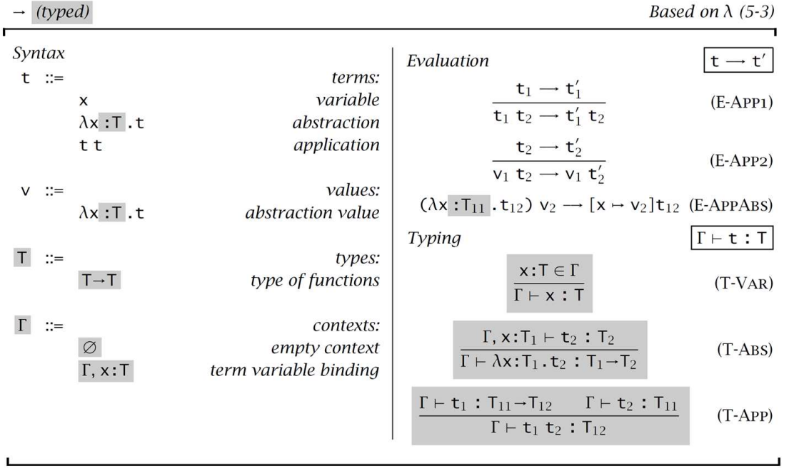

- 首先，为什么要引入环境$Γ$。
  - 比如：$λx:Int. x+y$, 如果没有类型推导或者$Γ={y:Int}$的环境说明，就无法完成判定。
- T-VAR: 在前文中出现的说明都会放入环境$Γ$。
- T-ABS: 上面一行，**环境和参数应该能推导出函数结果的类型**，则下面一行，在环境下可以确定函数的类型。
- T-APP: 指的是如何确定函数应用后的类型。

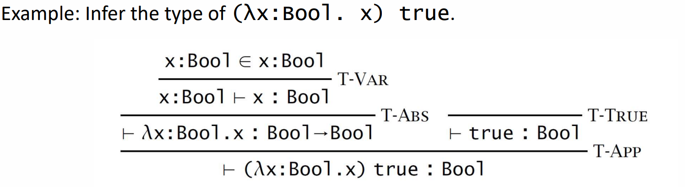


# Lecture 10: Subtyping


## 子类型的引入

- Subtyping（子类型）是为了支持**面向切面编程**（Aspect Oriented Programming, AOP），也就是说可以在多个类中调用他们共有的方法，这样可以提升代码的复用性，减少程序员的工作量。

- 例子：`(λr:{x:Nat}. r.x) {x = 0, y = 1}`
  - 这个 lambda 表达式 `λr:{x:Nat}. r.x` 期望参数是一个**只有 `x` 字段的记录** `{x: Nat}`。
  - 但实际提供的参数是 `{x = 0, y = 1}`，它包含额外的 `y` 字段。
  - **在没有子类型的情况下，系统无法匹配这两个类型，因此它会被卡住（stuck）。**

## OCaml面向切向编程

```ocaml
class animal (name : string) =
  object (self)
    val mutable animal_name = name
    val mutable age = 0
    val mutable alive = true 
      
    method get_name = animal_name
    method get_age = age
    method get_alive_status = alive 
      
    method age_increase offset = 
      age <- age + offset 
    method already_dead = 
      alive <- false
    method call_animal =
      print_endline(animal_name ^ " come here!")
  end;;

class dog (name : string)= 
  object (self)
    inherit animal name as super
    val mutable can_bark = true 
    method get_bark_status = can_bark
    method call_animal =
      print_endline("dog " ^ animal_name ^ " come here!")  
    method printf = print_endline("dog class")
  end;;

class human (name : string)= 
  object (self)
    inherit animal name as super
    val mutable gender = "male"
    method get_gender_status = gender
    method change_gender = 
      if gender = "male" then gender <- "female"
      else gender <- "male"
    method call_animal =
      print_endline("human " ^ animal_name ^ " come here!")  
    method printf = print_endline("human class")
  end;;

let practice_AOP_list =
  let x = (new dog "ldk" :> animal) in
  let y = (new human "zhl" :> animal) in
  [x; y] ;;


List.iter (fun x -> x#call_animal) practice_AOP_list;;
```

- 注意，这里因为`human`和`dog`类有不同名的方法，所以只能强制转化！如果名字相同，编译器会默认两个类相同。

## 子类型的数学引入

- 关键在于理解`{x:Nat, y:Nat} <: {x:Nat}`是正确的。`<:`就可以理解为“小于等于”。

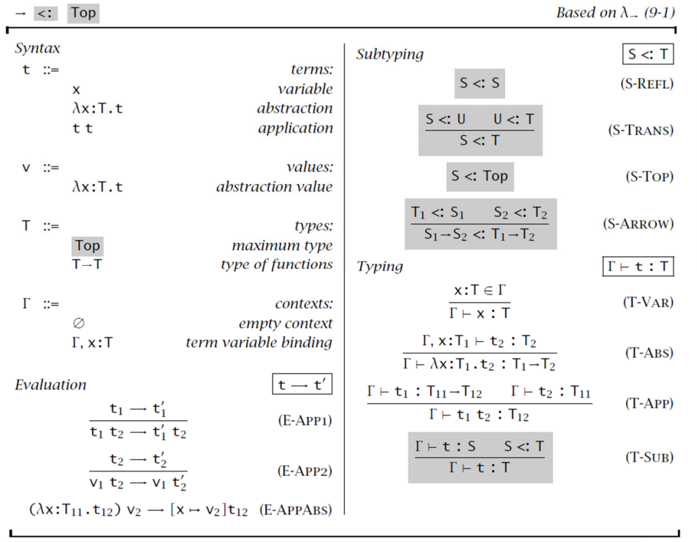

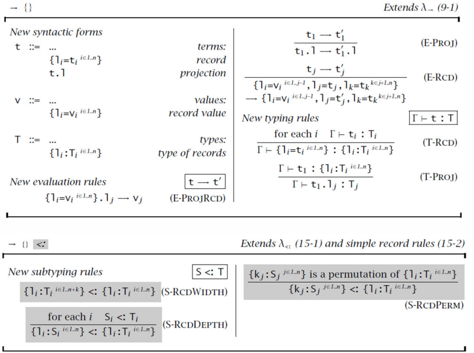

- T-SUB可以理解为子类型的定义。
- 在推导时，利用上述"S-type"定理，如：的自反律、传递律、子类型函数规则、S-TOP等。
- 引入了Record之后，可以辅助应用下述定理：
  - RCDWIDTH：如`{x : Nat; y : Nat} <: {x : Nat}`
  - RCDDEPTH：如`{x : {a : Nat; b : Nat}} <: {x : {a : Nat}}`
  - RCDPERM：如`{x : Nat; y : Nat} <: {y : Nat; x : Nat}`


## Ascription via Subtyping（基于子类型的指派）

- 在先前没有引入子类型的时候，指派没有实际意义，只是一个说明（标志），因为类型都是确定的。

### 向上类型转化up‐casts

- 将 `t` 指派给**超类型（supertype）**
- 可以通过这种方法隐藏字段、方法，数学表达：

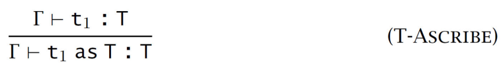

### 向下类型转化down‐casts

- 将 `t` 指派给**子类型（subtype）**
- 它允许开发者在类型系统无法静态推断出类型时，**显式指定目标类型**。这种转换方式通常带有风险，因此在许多语言中被视为不安全操作，尤其在没有运行时验证的情况下。

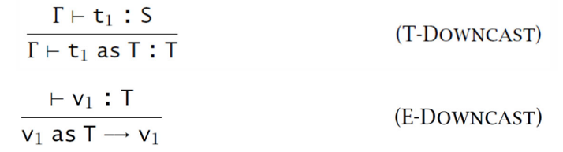

- 后者说明当转换是正确的时，它在执行过程中不会引入额外的操作。


## 交集类型（Intersection Types）

- **交集类型** `T1 ∧ T2` 表示类型 `T1` 和 `T2` 的交集。可以理解为一种类型，既满足 `T1`，又满足 `T2`。交集类型是 `T1` 和 `T2` 的**最大下界（Greatest lower bound）**，这意味着交集类型包含了 `T1` 和 `T2` 中的所有共同部分。

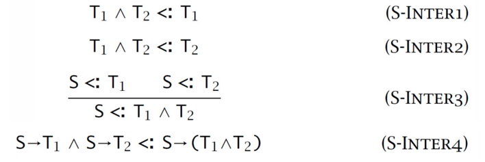

- 要注意的是，交集和并集容易混淆，在下面的例子中，交出来的类型虽然看起来“变多了”，但是实际上表示的范围却缩小了。

```ocaml
type AType = { a: number; b: string }
type BType = { b: string; c: boolean }
type Intersection = AType & BType
type Intersection = { a: number; b: string; c: boolean }
```

- 对编译器的实现不友好，支持的语言很有限。


# Lecture 11: Recursive Types


## 递归 (Recursion)

- 讲座的核心主题是递归类型，即类型定义中包含自身的类型。

- 引入固定点fix：

  - 简单例子：斐波那契数列

    `fib = fix (λf. λn. if n ≤ 1 then n else f(n-1) + f(n-2))`

  - 复杂例子：奇偶数判定

    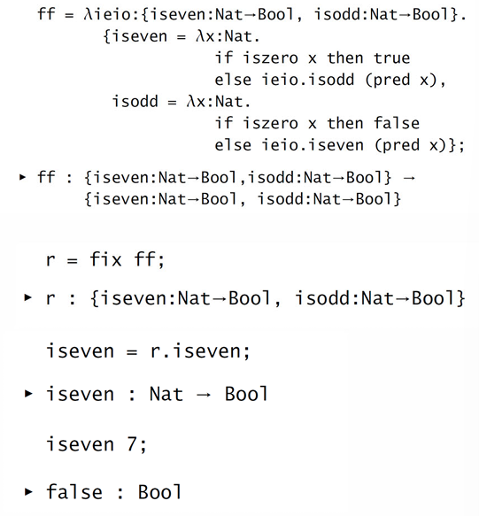


## 列表 (Lists) 作为递归类型

- **基本概念**: 列表是一种常见的数据结构，可以递归地定义：一个列表要么是空的 (nil)，要么是一个元素 (head) 后面跟着另一个列表 (tail)。

- **类型表示**: `List T` 表示包含类型 `T` 元素的列表。

- **数学展开**: 递归类型的定义可以无限展开。例如，自然数列表 `NatList` 可以看作：

  - `NatList = <nil:Unit, cons:{Nat, NatList}>`
  - 这表示一个 `NatList` 类型的值要么是 `nil` (类型为 `Unit`)，要么是 `cons` 结构，包含一个 `Nat` 类型的值和一个 `NatList` 类型的值。

- **μ 算子**: 为了表示这种无限递归结构，引入了递归类型算子 `μ`。

  - `NatList = μX. <nil:Unit, cons:{Nat,X}>`
  - 这里，`X` 是一个类型变量，`μX. T` 表示满足 `X = T` 的递归类型 `X`。

- **形式化方法 (Formalizations)**:

  - **Equi-recursive**: 认为递归类型 `μX.T` 和其单步展开 `[μX.T / X]T` 在定义上是相等的，可以互换。
  - **Iso-recursive**: 认为递归类型 `μX.T` 和其单步展开是不同的，但它们之间存在同构关系 (isomorphic)，需要显式的 `fold` 和 `unfold` 操作进行转换。

  - 问题：**OCaml 明明可以直接写 `hd :: tl` 来拆 `list`，那不是 equi-recursive 吗？**并不是！ 这只是语言语法层提供的“糖”（syntactic sugar），类型系统底层仍是 iso-recursive。

  | 你看到的行为              | 实际类型系统行为              |
  | ------------------------- | ----------------------------- |
  | 可以用 `hd :: tl` 拆 list | 是构造器+语法糖，不是类型等价 |
  | 类型不自动替换            | `'a list ≠ 'a * 'a list`      |
  | 手动匹配构造              | 属于 iso-recursive 系统       |

- **列表操作函数/构造器**: 

  - `nil`: 空列表。
  - `cons`: 构造器，接受一个元素和一个列表，生成一个新的列表 (将元素添加到列表头部)。
  - `isnil`: 检查列表是否为空。
  - `hd`: 获取列表的第一个元素 (head)。
  - `tl`: 获取列表除第一个元素外的剩余部分 (tail)。
  - `sum`: 计算列表元素的和 (示例函数)。

  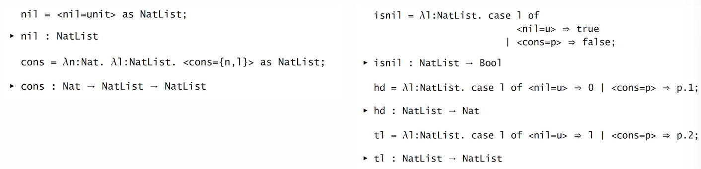

## 其他递归类型示例

- **饥饿函数 (Hungry Functions)**:
  - 定义: `Hungry = μA. Nat→A`
  - 解释: 一个接受 `Nat` 类型参数并返回另一个 `Hungry` 函数的函数。
  - 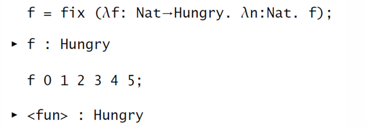
- **流 (Streams)**:
  - 定义: `Stream = μA. Unit →{Nat,A}`
  - 解释: 一个接受 `Unit` 参数并返回一个包含 `Nat` 和另一个 `Stream` 的记录的函数。可以用来表示无限序列。
  - 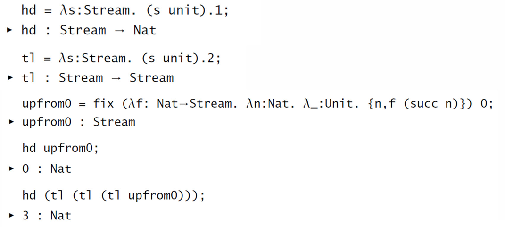
- **进程 (Processes)**:
  - 定义: `Process = μA. Nat→{Nat,A}`
  - 解释: 类似于流，但接受一个 `Nat` 参数，返回一个包含 `Nat` 和另一个 `Process` 的记录。可以用来模拟状态和输入/输出。
  - 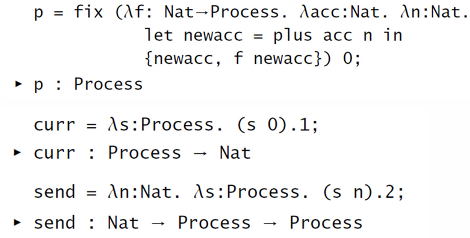
  - 
- **对象 (Objects - 函数式风格)**:
  - 定义 (以计数器为例): `Counter = μC. {get:Nat, inc:Unit →C, dec:Unit→C}`
  - 解释: 一个包含方法的记录。方法接受参数并返回一个新的对象 (新的状态)。例如，`inc` 方法接受 `Unit`，执行增加操作，并返回一个新的 `Counter` 对象。
  - 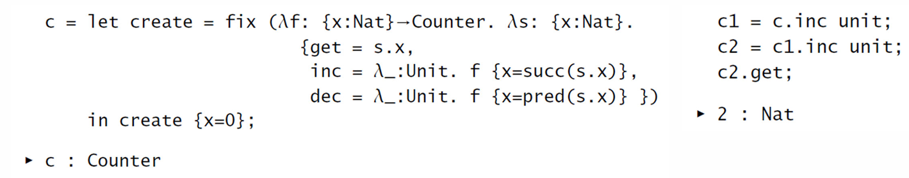


# Lecture 12: Polymorphism


## 多态性 (Polymorphism)

* **定义**: 允许单一代码片段用于多种类型的系统。

* **种类**: 

  * **参数多态 (Parametric Polymorphism)**:

    *   使用类型变量进行泛型编码，后续实例化为具体类型。
    *   实例行为一致 (Uniform)。
    *   **Let-多态 (Let-polymorphism)**: 限制在顶层 let 绑定。
    *   **一等多态 (First-class Polymorphism)**: 允许传递多态值作为参数 (ML 基础)。

    ```ocaml
    let apply_twice f = (f 1, f true)  (* 编译失败，因为 f 不能在不同类型下多次使用 *)
    let apply_twice (f : 'a. 'a -> 'a) = (f 1, f true)  (* f 是多态函数 *)
    ```

  * **特设多态 (Ad-hoc Polymorphism)**:

    *   多态值在不同类型下表现不同行为。
    *   **重载 (Overloading)**: 常见例子，单一函数符号关联多个实现。

    ```c
    int add(int a, int b) { return a + b; }
    double add(double a, double b) { return a + b; }
    ```

  * **内涵多态 (Intensional Polymorphism)**:

    *   允许运行时对类型进行有限计算。
    *   类型反射（reflection）
    *   类型匹配（**typecase**）
    *   有界泛型 + 类型检查（如 Java 的 `instanceof`）


## 类型重建 (Type Reconstruction)

*   **目标**: 在缺少部分或全部类型标注时，推断出项 (term) 的主类型 (principal type)。这是类型检查的重点。
*   **类型变量 (Type Variables)**: 未解释的基础类型的占位符 (如 X, Y)。
*   **类型替换 (Type Substitution)**:
    *   定义: 从类型变量到类型的**有限映射**，记作 𝜎。
    *   应用: 将 𝜎 应用于类型 T 得到实例 𝜎T。
        *   假设我们有类型变量 `X` 和类型 `Bool`，定义一个类型替换规则：σ = [X ↦ Bool]
        *   现在，应用这个替换规则到类型 `X → X` 上，结果就是：σ(X → X) = Bool → Bool
    *   规则:
        *   `𝜎(X) = T` 如果 `(X ⟼ T) ∈ 𝜎`
        *   `𝜎(Y) = Y` 如果 `Y ∉ dom(𝜎)`
        *   `𝜎(T1 → T2) = 𝜎(T1) → 𝜎(T2)`
        *   `𝜎(∀X. T1) = ∀X. 𝜎'(T1)` 其中 `𝜎'` 是从 𝜎 中移除 X 映射得到的替换。
*   **类型解 (Type Solutions)**:
    *   对于上下文 Γ 和项 t，解是 (𝜎, T) 使得 `𝜎Γ ⊢ 𝜎t : T`。
*   **基于约束的类型推导 (Constraint-based Typing)**:
    *   计算必须被解满足的约束集合 C。
    *   约束: 类型表达式之间的等式，如 `T1 = T2 → X`。
    *   约束集: `C = {Si = Ti | i ∈ 1..n}`。
    *   约束类型关系: `Γ ⊢ t : T | C` (在约束 C 满足时，t 在 Γ 下有类型 T)。
    *   推导规则 (部分):
        *   `(VAR)`: `Γ, x:T ⊢ x : T | {}`
        *   `(ABS)`: 如果 `Γ, x:T1 ⊢ t2 : T2 | C`，则 `Γ ⊢ λx:T1. t2 : T1 → T2 | C`
        *   `(APP)`: 如果 `Γ ⊢ t1 : T1 | C1` 且 `Γ ⊢ t2 : T2 | C2`，则 `Γ ⊢ t1 t2 : X | C1 ∪ C2 ∪ {T1 = T2 → X}` (X 是新类型变量)
*   **合一算法 (Unification Algorithm)**:
    *   用于求解约束集 C。
    *   找到一个替换 𝜎 使得对于 C 中的所有 `Si = Ti`，都有 `𝜎Si = 𝜎Ti`。
    *   目标是找到 **最一般合一子 (most general unifier, mgu)**。
    *   约束集的**主统一器（principal unifiers）**: 它试图找到一种方式将类型表达式中的变量统一到一个共同的类型。


## 通用类型 (Universal Types) - System F

* **动机**: 避免为不同类型重复编写功能相似的代码 (如 `double` 函数)，遵循抽象原则。

* **别名**: 多态 Lambda 演算，二阶 Lambda 演算。

* **核心扩展**: 

  *   **类型抽象 (Type Abstraction)**: `λX. t` - 抽象出一个类型变量 X。
  *   **类型应用 (Type Application)**: `t [T]` - 将类型 T 应用于一个类型抽象。

* **求值规则**: 

  *   `(E-TAPPABS)`: `(λX. t12) [T2] ⟶ [X ⟼ T2] t12` (类型应用)
  *   `(E-APPABS)`: `(λx:T11. t12) v2 ⟶ [x ⟼ v2] t12` (普通应用，同 STLC)

* **类型规则**: 

  *   `(T-TABS)`: 如果 `Γ, X type ⊢ t : T`，则 `Γ ⊢ λX. t : ∀X. T`
  *   `(T-TAPP)`: 如果 `Γ ⊢ t : ∀X. T11`，则 `Γ ⊢ t [T12] : [X ⟼ T12] T11`

* **示例**: 

  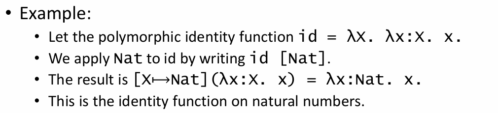

  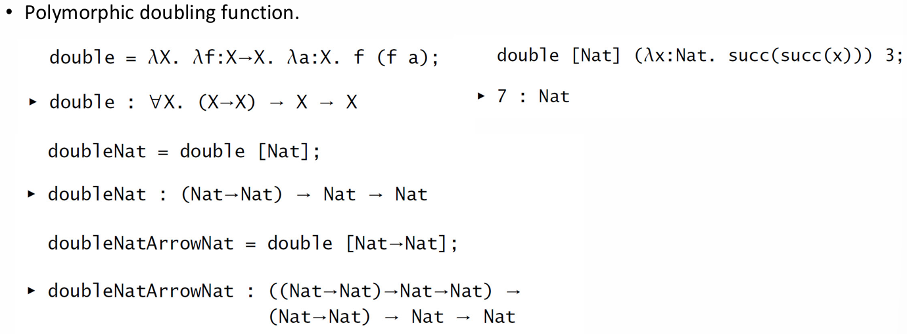


# Lecture 13: Recursive Descent Parsing


- 先前都是数学上的定义和推导，从本讲开始侧重代码实现。

## Scanner & Parser概述

### Scanner(Lexer, 词法分析器)

- 作用：从字符串转换为token（word，单词）的集合。

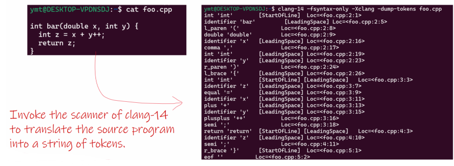

- clang提供了类型及其字符（和后文属性文法有关联），及代码具体位置。

### Parser(语法分析器)

- 作用：
  - 判定语法是否正确；
  - 生成中间语言（Intermediate Representation，IR），比如大多数语法分析器都会生成的抽象语法树（AST），要注意和附注语法树的区别。

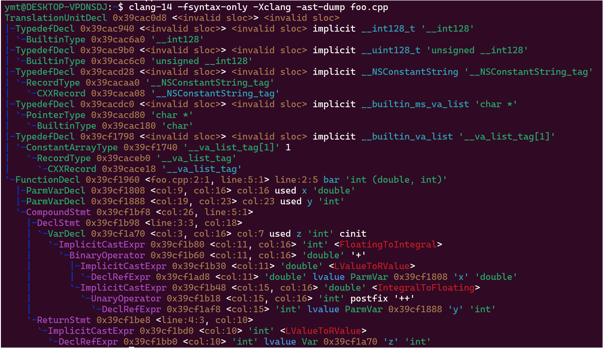

- 无需关注前面半部分；后半部分可见AST树并非一定是二叉树。


## Scanner的完整实现

### 利用ocamllex自动生成

- 根据之前所学，正则表达式和FSA是等价的，我们可以根据一个正则表达式，通过汤普森构造法，形成一个自动机。

- 转化逻辑如下：

  ```c
  regular expression -> lex (UNIX) -> a language scanner
  regular expression -> flex (Linux) -> a language scanner
  regular expression(.mll) -> ocamllex (Ocaml) -> a language scanner(.ml)
  ```

- 具体实现见tutorial。

### 手写Scanner

- 和automaton之间的区别，scanner不仅是对一个token的识别，而是一整个序列的token，在一个token识别完了之后，要回到初始状态准备识别下一个。
- 相比于用lex工具，手写的方式更加灵活。

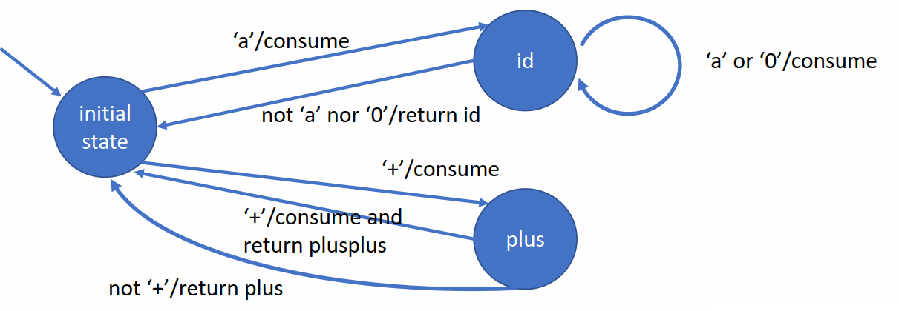

```ocaml
type token = 
  | Identifier
  | Plus
  | Plusplus ;;

let tail str = String.sub str 1 ((String.length str) - 1);;

(* normally, the number of output lines is the number of match items;
exceptions deal with end of input unless exist a symbol like '$' to mark the end of input*)
let rec id_state str =
  match String.get str 0 with 
  | exception (Invalid_argument ia) -> (Identifier, "")
  | 'a' -> id_state (tail str)
  | '0' -> id_state (tail str)
  | _ -> (Identifier, str);; 

(* if no self_objected possibility, then no rec *)
let plus_state str = 
  match String.get str 0 with 
  | exception (Invalid_argument ia) -> (Plus, "")
  | '+' -> (Plusplus, tail str)
  | _ -> (Plus, str);;

(* return a token list, 
but other states can only return tuple (token, string) *)
let rec initial_state str =
  match String.get str 0 with 
  | exception (Invalid_argument ia) -> []
  | 'a' -> let ret = id_state (tail str) in
      (fst ret) :: initial_state (snd ret)
  | '+' -> let ret = plus_state (tail str) in
      (fst ret) :: initial_state (snd ret)
  | ' ' -> initial_state (tail str)
  | _ -> failwith "Error!";;


initial_state "aaa+++";;
initial_state "aa+a+";;
initial_state "++a";;
```


## Parser带有瑕疵的实现

- 这部分源于下推自动机（PDA），但是由于是幂级的分支，所以是**not tractable**的。除非知道正确的路径，即**确定性的下推自动机**（deterministic pushdown automaton）
- **Recursive descent parser（递归下降法）：自顶向下（从开始符号出发，逐步展开）**，适用于 LL(1) 文法（没有左递归）。
- $A\rightarrow \gamma_1|\gamma_2 | ...|\gamma_n$，对任意$\gamma_i$，设定$First(\gamma_i) = \{x|\gamma_i \rightarrow*x\delta\}$，如果有$a \in First(\gamma_i)$，则$\gamma_i$被选中了。如果有多个选中，则不是LL(1)的算法，一般情况下不能克服（除非用眼睛看）。
- 另外$Follow(\gamma_i)$是在表达式中出现了$\epsilon$后的处理方式，这二者下节课详细讲解，是瑕疵之一。

- 例子：文法为什么变成这样也是瑕疵之一。

  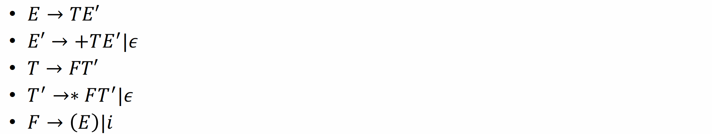

```ocaml
let tail str = String.sub str 1 (String.length str - 1)

let rec list_of_string str =
  match String.get str 0 with
  | exception Invalid_argument ia -> []
  | x -> x :: list_of_string (tail str)
;;

(* only to ensure the correctness of input string *)

(* notice that the FIRST set can only be observed *)
(* be careful whether the FIRST element can be deleted!*)
(* since functions are called in a circle, use 'and' expression!*)
(* e -> te' *)
let rec e lst =
  match lst with
  | '(' :: tail | 'i' :: tail -> e1 (t lst)
  | _ -> raise (Failure "error e")

(* e' -> +te'|epison *)
and e1 lst =
  match lst with
  | '+' :: tail -> e1 (t tail)
  | '$' :: tail | ')' :: tail -> lst
  | _ -> raise (Failure "error e1")

(* t -> ft' *)
and t lst =
  match lst with
  | '(' :: tail | 'i' :: tail -> t1 (f lst)
  | _ -> raise (Failure "error t")

(* t' -> *ft' | epsilon *)
and t1 lst =
  match lst with
  | '*' :: tail -> t1 (f tail)
  | '+' :: tail | ')' :: tail | '$' :: tail -> lst
  | _ -> raise (Failure "error t1")

(* f -> (e) | i *)
and f lst =
  match lst with
  | '(' :: tail -> e tail
  | 'i' :: tail -> tail
  | _ -> raise (Failure "error f")
;;

let rec print_list lst =
  match lst with
  | h :: t ->
    Printf.printf "%c\t" h;
    print_list t
  | [] -> ()
;;

let output = e (list_of_string "i+i*i$");;
print_list output

let output = e (list_of_string "i+i*i+i$");;
print_list output
```

- 这是`list_of_string`的另外一种实现：

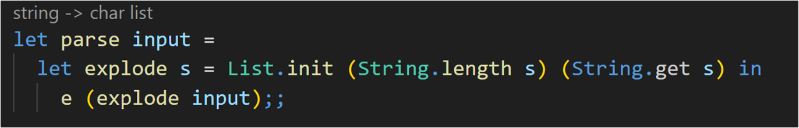


# Lecture 14: LL(k) Parsing

## Top‐down Parsing（自顶向下解析器）

- 基本和递归下降法是一个概念。
  - 首先，将“$S”推入栈中，然后替换、匹配，最后判定是不是仅剩余\$。
  - 产生问题，𝐴 → 𝐴𝛼这种表达式产生死循环，程序无法终止。

### 文法的修改

- 消除左递归（Elimination of left recursion）
  - 𝑃 → 𝑃𝛼|𝛽，可以改为：𝑃 →𝛽𝑃′, 𝑃′ → 𝛼𝑃′ |𝜖；
  - $P \rightarrow P\alpha_1|P\alpha_2|...|P\alpha_m|\beta_1|\beta_2|...|\beta_n$，可以改为$P\rightarrow\beta_1P'|...|\beta_nP'; P'\rightarrow\alpha_1P'|...|\alpha_mP'|\epsilon$。

- 消除间接左递归（Eliminating indirect left recursion）
  - 处理方法是，先降维成一维 问题，再消除左递归，如：
    - 𝑆 → 𝑄𝑐|𝑐
    - 𝑄 → 𝑅𝑏|𝑏
    - 𝑅 → 𝑆𝑎|𝑎
    - 则：𝑅 →𝑅𝑏𝑐𝑎|𝑏𝑐𝑎|𝑐𝑎|𝑎，再进而𝑅 → 𝑏𝑐𝑎𝑅'|𝑐𝑎𝑅'|𝑎𝑅′;  𝑅'→ 𝑏𝑐𝑎𝑅'|𝜖

- 例子：

  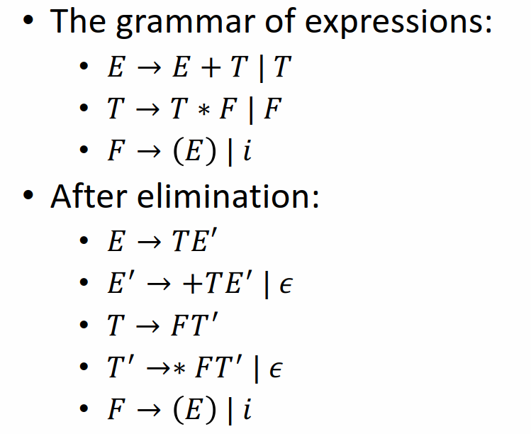

### 存在的问题及对策

- 对于同一非终结符可能产生多个产生式，从而导致幂级的分裂，是一种not tractable的算法。
- LL(k)算法的基本想法就是向前“偷窥”k个栈中的非终结符。
- 常见的是LL(1), LL(2)。


## LL(1) Parsing

### $First$函数的概念

- $First(α) = \{ a | α ⇒* aβ, a ∈ V_T, β ∈ (V_N ∪ V_T)* \}$，一般写为$First(\gamma_i)$。但是，如果$\epsilon\in First(\gamma_i)$，则需要进一步借助$Follow$。如果多个产生式满足条件，则不是LL(1)能解决的问题了。

### $Follow$函数的概念

- $Follow(A) = \{ a | S ⇒* αAaβ, a ∈ V_T, α, β ∈ (V_N ∪ V_T)* \}$，一般写为$Follow(A)$。根据定义，不需要担心A后面的非终结符依然推导为$\epsilon$。
- 综上，在$A\rightarrow\gamma_1|\gamma_2|...|\gamma_n$，$A$是栈顶的非终结符，$a$是输入字符。
  - $a\in First(\gamma_i)$，则$A\rightarrow\gamma_i$被选中；
  - $\epsilon\in First(\gamma_i), a\in Follow(A)$，则$A\rightarrow\gamma_i$被选中;
  - 如果没有选中的产生式，则需要汇报错误；
  - 如果多个表达式被选中，则不是LL(1)的问题。

### 𝐹𝑖𝑟𝑠𝑡() 的实现

- **依次循环遍历每一个产生式**，将终结符放入相应的$First$集合，直到各集合不再变化。
- $First(\gamma_i)$和$Follow(A)$在本算法的不同步骤中都需要求解出来。

### 𝐹𝑜𝑙𝑙𝑜𝑤() 的实现

- **依次循环遍历每一个产生式**：
  - 先给开始符号$S$的$Follow$集合加入\$元素；
  - 如果$B\rightarrow \alpha A \beta$，则$First(\beta)/ \{ \epsilon \}   ⊆ Follow(A)$；
  - 如果$B\rightarrow \alpha A \beta$并且$\epsilon \in First(\beta)$，则$Follow(B) \in Follow(A)$；

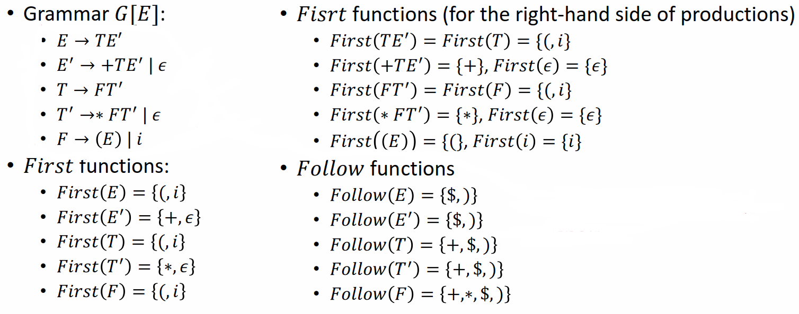

### 表驱动分析

- 这一部分强调的是如何利用上述求解的$First,Follow$集合，确定出自上而下化简的流程。可见，此表中，同一非终结符的多个产生式是需要划分开的。

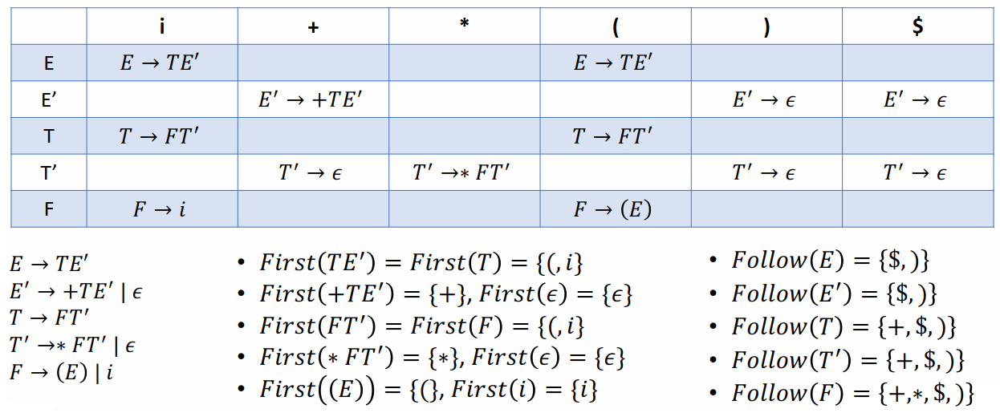

- 一个语法分析器实现的例子：

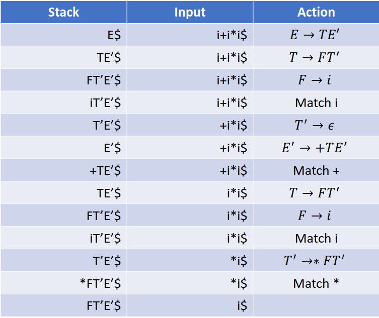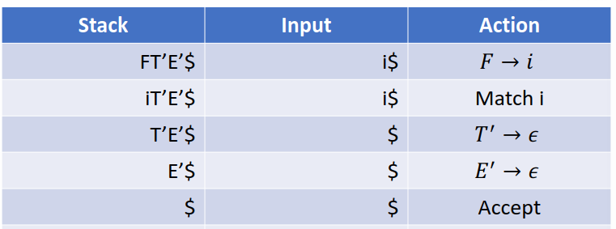

## 和Lecture 13之间的关系

- 本讲弥补了Lecture 13中Paser的两个瑕疵，一个是文法为何要修改，一个是如何用计算机算法稳妥地算出$First, Follow$集合。
- 本讲中实现的表格可以自动根据文法确定，进而上次课的$First, Follow$集合可以被自然的得出。


# Lecture 15： LR(k) Parsing

- 前面的方法是从一个根节点不断分化（derivations），称之为Top-down方法，现在介绍的是Bottom‐up Parsing，他是利用规约（reductions）和移进（shift）的方法判定的。

## 基本概念

### Shift‐reduce parser（移位-规约编译器）

- 流程：

  - 引入新的开始符号$S'$，这样如果栈中$S'$成为了栈顶，则调用结束；
  - 尽可能实现栈中数据的规约，如果暂时无法规约，则进行移进；
  - 可以理解为当$S'$和$\$$相遇，则accept。

- $G[S'] := S' \rightarrow S;S \rightarrow 0S1|\epsilon $

  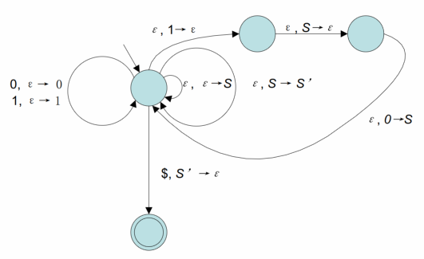

### handle（句柄）

- 定义：一个“可规约”字符串，如下图的$\beta$：

  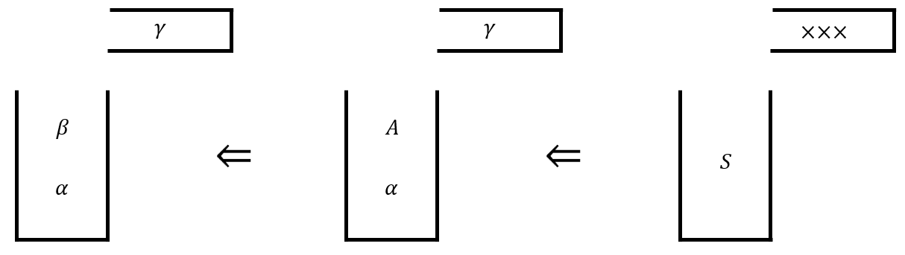

- 正常情况下，如果需要知道句柄的形式，就需要等到语法树全都建立好之后才行。只有引入了决定性下推自动机（DPA）才能避免不确定性；

- 引入“·”号，作为栈和输入字符的分界标志。

### LR(0)

- **可行前缀（viable prefixes）**：$S\rightarrow \alpha \beta$，任意字符串$\alpha$都是可行前缀；
- 句柄的条件：$A \rightarrow \gamma $且$\beta \gamma$是可行前缀。
- LR(0)意味着没有前瞻，例如：终结符$c,d$都在产生式的最前面；
  - 𝐸 → 𝑎 ⋅ 𝐵
  - 𝐵 →⋅ 𝑐𝐵
  - 𝐵 →⋅ 𝑑

  

## LR(0)具体案例

### 文法描述

- 文法表达式：

  - 𝑆 ' → 𝐸

  - 𝐸 → 𝑎𝐵

  - 𝐸 → 𝑏𝐴

  - 𝐴 → 𝑐𝐴

  - 𝐴 → 𝑑

  - 𝐵 → 𝑐𝐵

  - 𝐵 → 𝑑

- 文法图：

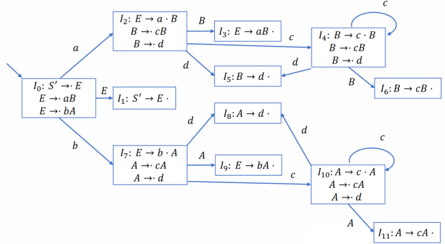

### 语法分析表

- $s_i$代表着shift，即从input中取出字符压入栈中，将符号栈置为第$i$个状态；
- $r_j$代表着reduce，即先弹出状态和符号栈，再根据当时的符号栈和弹出符号判定下一个操作。

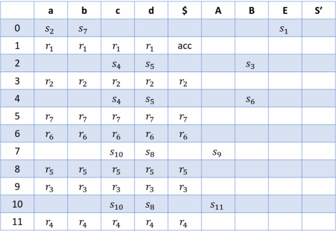

### 运行实现

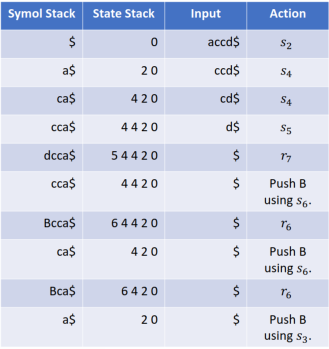

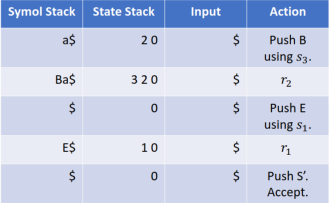


## SLR(1)概念及典型案例

-  概念：𝐴 → 𝛼 ⋅ is reducible only if the input symbol 𝑎 ∈ 𝐹𝑜𝑙𝑙𝑜𝑤(𝐴).可以理解为引入了 𝐹𝑜𝑙𝑙𝑜𝑤集合。
- 为了避免“移进-规约冲突”，如：$E' \rightarrow E ·$以及$E \rightarrow E·+T$在不知道下一个input stack 的元素时是不能规约的。


# Lecture 16：Attribute Grammars


## 引入及前后逻辑梳理

- Attribute Grammars(属性文法) = grammar + attributes + restricted rules.
- 在Lecture13实现了基本的语法正确性的判定，Lecture14和15用了两种不同方法实现了缺陷的补齐。
- 这一讲在语法正确性的基础上引入了语义的规则部分，下一讲引入了语义的实现，合起来就是语法分析器的完整实现了，也就是从一个初始语言“编译”为目标语言，如：从中缀表达式到后缀表达式，从C语言到汇编语言。
- 后面的课程更多侧重于如何提高编译的性能，也就是需要在语法分析的过程中截出中间语言（Intermediate Representation，IR）。


## 属性文法的组成

### 语义如何表示

- 因为需要被计算机存储，所以需要用数据结构中的结构来存储语义。
  - **属性的集合**：用来代表单个符号的含义。
  - **加注语法树（附注语法树，Decorating Syntax Tree）**：含有了顺序信息、各种运算规则和最终值，表示一个语句的含义。

### 属性文法的组成部分

- 为每一个符号匹配一个属性的集合$A(X)$，比如一个整数应该被$Scanner$转换为$int_{value=x}$；
- 为每一个表达式匹配一个规则的集合$E(p)$，其中每一个规则形如$x=f(y_1,y_2,...,y_n)$。

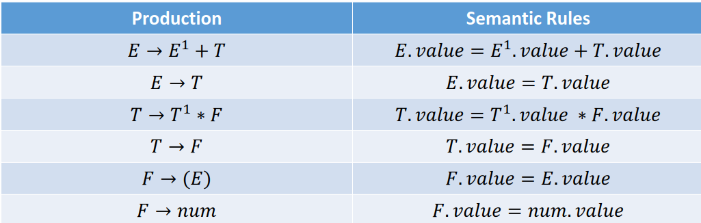


## 属性文法设计及加注语法树的绘制

### 案例一：二进制补码的求解流程

1. 先设计语法规则；

2. 再设计语义规则以及需要的属性和函数；

   1. 本题中，容易想到的算法是负数减去$2^n$的偏差；或者取反。前者需要引入一个额外的attribute，后者需要引入取反函数。
   2. 本题中，if-else语句是无法避免的。

3. 绘制对应表：要注意每一个产生式对应相应的语义规则

   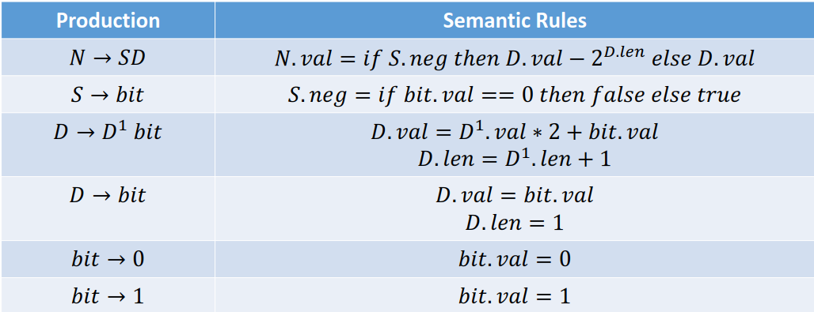

   - 在上表中，Bit应该大写，但是更正确的写法是bit作为终结符，具有一个value属性。

4. 绘制加注语法树：

   1. 先画树状结构：可以选择Top-down，也可以选择Bottom-up，一般情况下前者会更美观；
   2. 再标注红色的推导过程：**自下而上进行标注**。

   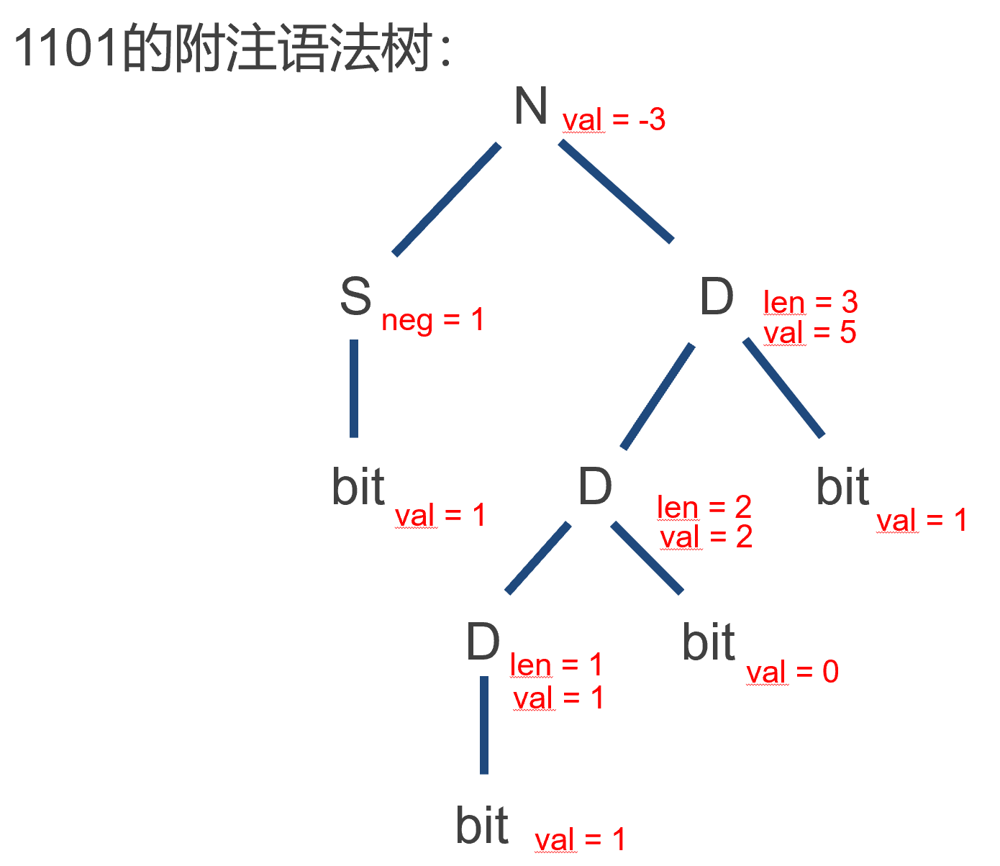

### 案例二：中缀表达式转为后缀表达式

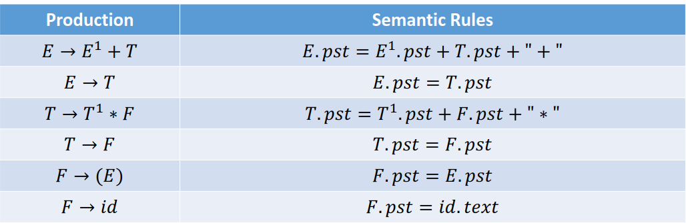

- 和“案例一”非常类似，不再详细说明。

### 案例三：C语言风格的声明语句

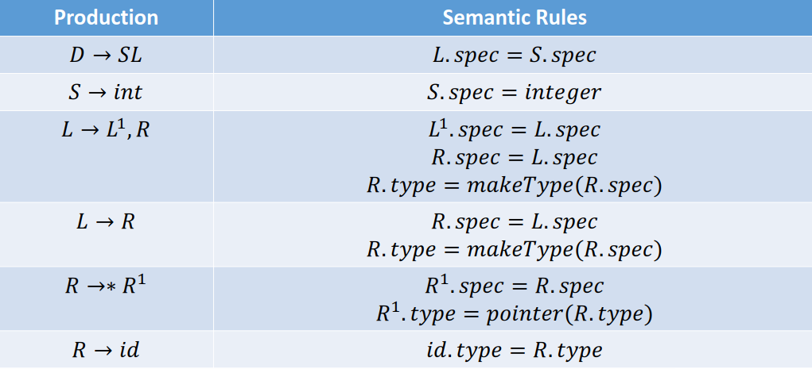

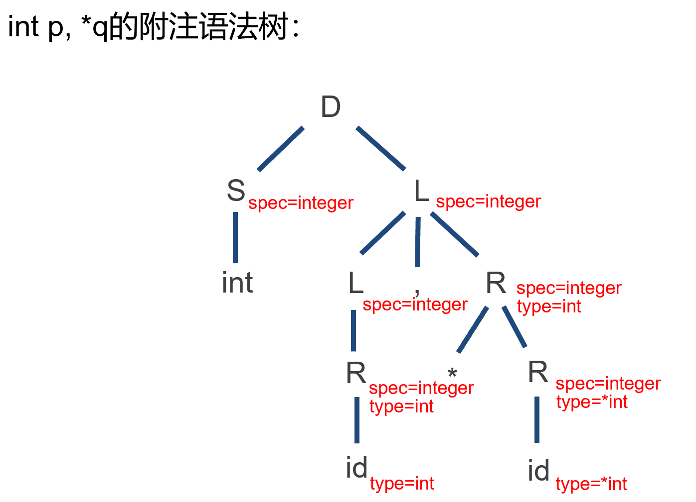


# Lecture 17：Syntax‐Directed Translation


## 语法制导翻译的概念

- **Syntax-Directed Translation (SDT)** 是一种将**语法分析与语义处理相结合**的技术。
- 在构造语法分析树的过程中，**顺便完成语义处理（如类型检查、中间代码生成）**。
- **综合属性（Synthesized attributes）和继承属性（Inherited attributes）**

  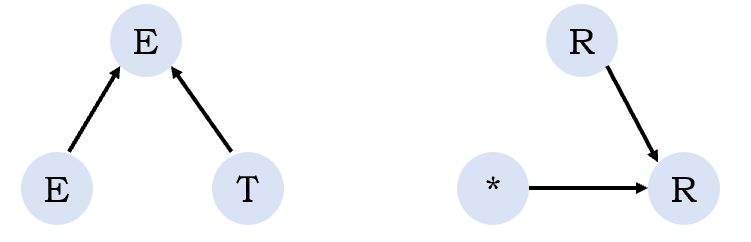

- 基本处理方式：
  - **Top-down（也称为递归下降法）**：使用 **函数调用和返回值** 来传递属性，**自然支持继承属性**（通过函数参数）。通常是**手写** parser，每个非终结符写一个函数。
  - Bottom-up（如LR分析器）：**综合属性为主**，继承属性较难处理（需要技巧），属性值常放在 `$1`、`$2`、`$$` 等变量中，一般利用yacc工具自动转换。


## Top-down(Recursive descent)的代码实现

### 语法和语义对照表

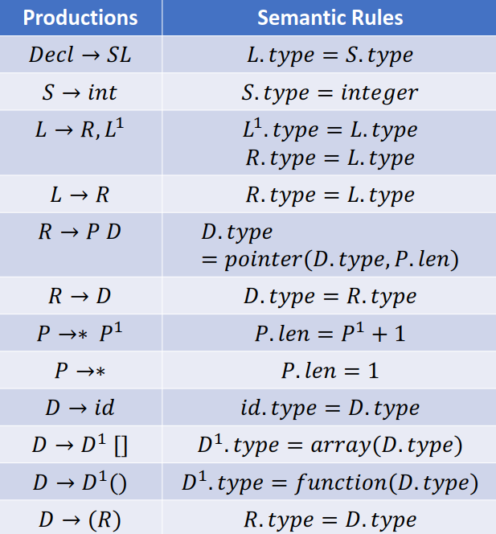

- 注意到，上表中存在普通左递归，改为$D\rightarrow id M| (R) M; M\rightarrow []M|()M|\epsilon$。

- 举例：int \*p[], (\*p)[]

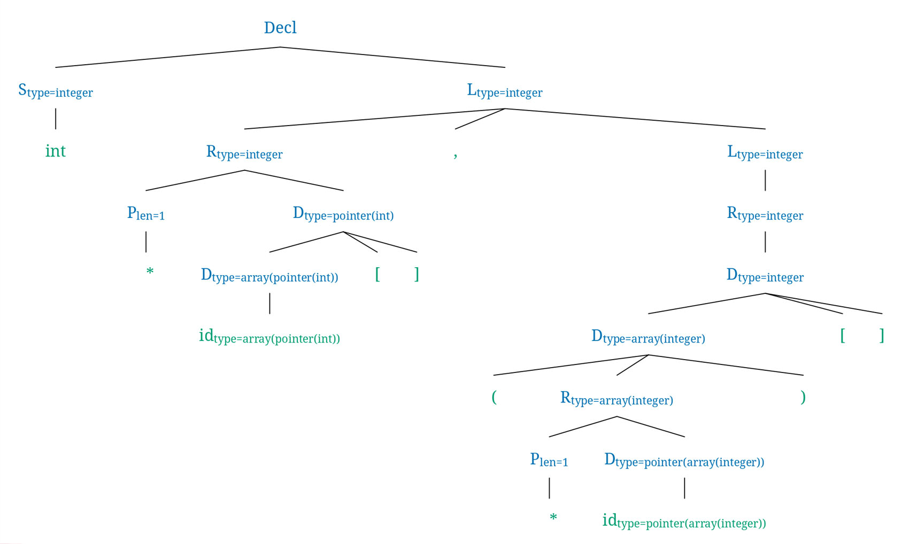

- 接口设计与流程：

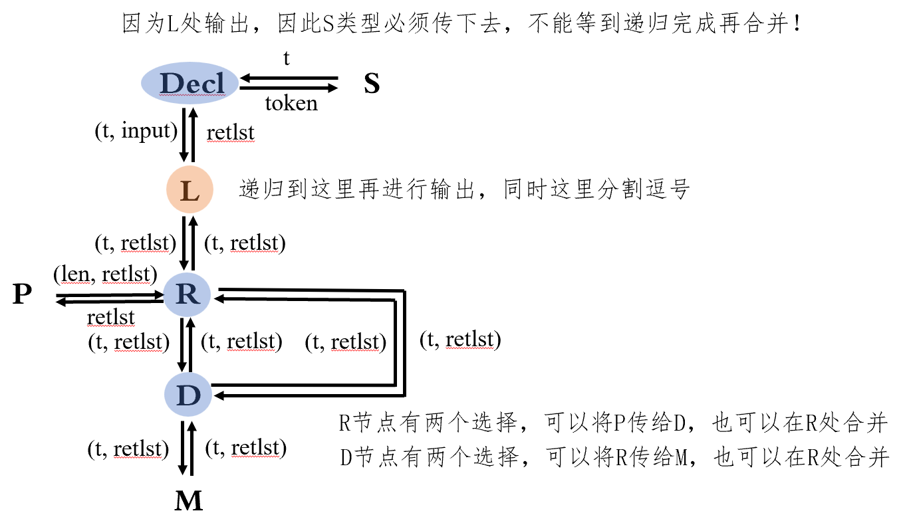

```ocaml
type token = 
  | Identifier
  | Integer 
  | Char
  | Symbol of char;;

type tp = 
  | TUnknown
  | TInt
  | TChar
  | TArray of tp
  | TPtr of tp;;

let rec print_type t =
  match t with 
  | TUnknown -> print_string "()"
  | TInt -> print_string "integer"
  | TChar -> print_string "character"
  | TArray(s) -> print_string "[]->"; print_type s
  | TPtr(s)-> print_string "*->"; print_type s;;

let rec pointer len t =
  if len <= 1 then TPtr(t) else TPtr(pointer (len - 1) t);;


(* S -> int *)
let rec s_state tok = 
  match tok with 
  | Integer -> TInt
  | Char -> TChar
  | _ -> raise (Failure "error s");; 


(* L -> R,L1 | R *) 
let rec l_state t input =
  match input with 
  | [] -> ()
  | tok :: xs -> 
      match tok with 
      | Identifier | Symbol('(') | Symbol('*') -> 
          let (rt, retlst) = r_state t input in
          print_type rt; print_endline " ";
          (match retlst with
           | Symbol(',') :: xs -> l_state t xs
           | _ -> ())
      | _ -> raise (Failure "error l")


(* R -> PD  |  D *) 
and r_state t input = 
  match input with 
  | tok :: xs ->
      (match tok with 
       | Symbol('*') ->
           let (retlst, len) = p_state  0 input in
           let (ts, retlst2) = d_state t retlst in
           ((pointer len ts), retlst2)
       | Symbol('(') | Identifier ->
           d_state t input
       | _ -> raise (Failure "error r"))
  | _ -> raise (Failure "error r")
               


(* P -> *P1  | * *)
and p_state len input =
  match input with 
  | Symbol('*') :: xs -> 
      let new_len = len + 1 in
      p_state new_len xs
  | _ -> (input, len)
  

(* D -> id M | (R) M*)
and d_state t input =
  match input with 
  | Identifier :: xs -> 
      let (ts, retlst) = m_state t xs in
      (ts, retlst)
  | Symbol ('(') :: xs ->
      let (ts, retlst) = r_state t xs in
      (match retlst with
       | Symbol(')') :: rxs -> m_state ts rxs
       | _ -> raise (Failure "error d"))
  | _ -> raise (Failure "error d")

(* M -> []M1 | epsilon *)
and m_state t input = 
  match input with 
  | Symbol('[') :: Symbol(']') :: xs ->
      let (ts, retlst) = m_state t xs in
      (TArray(ts), retlst)
  | Symbol(')')::xs | Symbol('$')::xs | Symbol(',')::xs -> (t, input)
  | _ -> raise (Failure "error m");;


(* Decl -> SL *)
let decl_state input =
  match input with  
  | [] -> ()
  | tok :: xs ->
      match tok with 
      | Integer | Char -> 
          let t = s_state tok in
          l_state t xs
      | _ -> ();;

let parse input =
  let explode s = List.init (String.length s) (String.get s) in
  let m x = match x with 
    | 'i' -> Integer 
    | 'a' -> Identifier
    | _ -> Symbol(x) in
  let l = List.map m (explode input) in
  decl_state l;;

parse "i*a[]$";;
  
parse "i*a[],a$";;

parse "i(*a)[]$";;

parse "i*a,a[]$";;

parse "i*(*a)[][],a$";;
```


## Bottom-up 的理论实现

- 在LR(0)分析中，用了一个Input stack，以及两个同步的栈State stack & Symbol stack。这里又要引入一个同步的栈，即 Semantic stack，这里用于存储对应符号的属性。

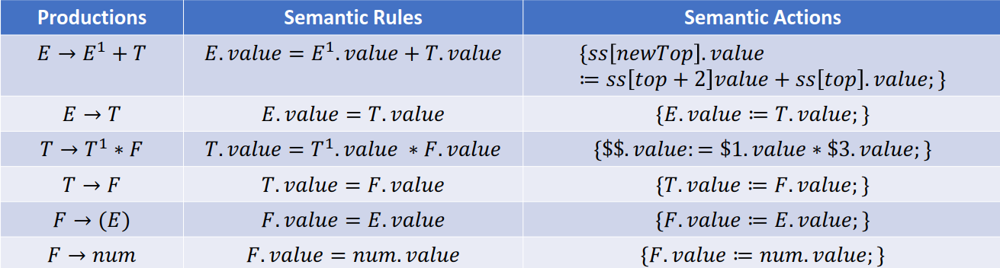

- 其中，第一行"ss"的格式是数学表达形式，第三行"$"的格式是yacc的表达形式，其余行是简化表达形式。与 **LALR(1)**（而非 LR(0)）类型的分析器兼容，可以通过 `yacc`（或现代工具如 `Bison`）生成对应的语法分析器。

- 这种方法的问题在于继承属性：暂未被规约的父节点的属性不在栈中，在yacc工具的语法中，可以用\$0,\$-1这些来调用。

  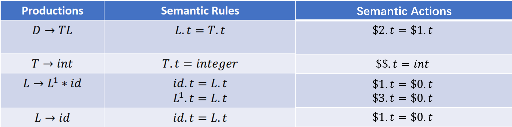

  - 更进一步存在问题：如果需要的信息不来源于一个固定的地方，这就需要专门为信息提供一个专门的状态位来保存。

    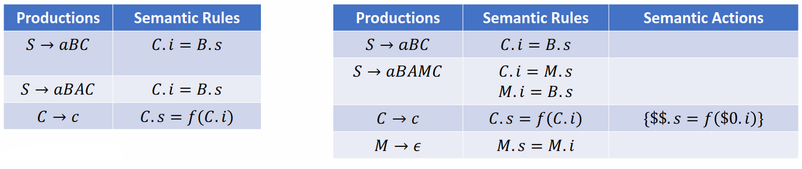


# Lecture 18：Intermediate Representations


## 引入中间表示的目的

- 虽然前面的逻辑已经可以实现编译的基本功能，即从一个形式的语言，处理为另外一种形式的语言。

  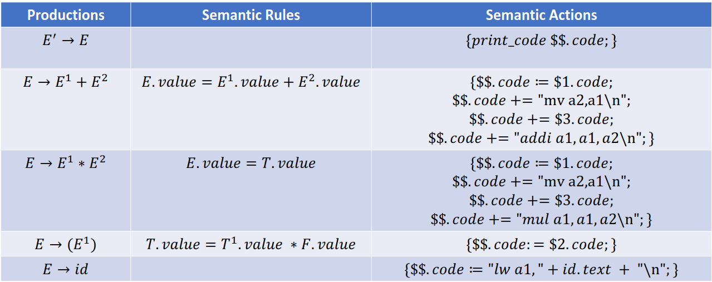

- 但是，不难发现上面的方法效率非常低下（纯文本无法进行优化），而编译优化的算法需要编译过程中的一部分中间数据结构才行，因此引入中间表示。

## 常见中间表示

### Abstract syntax tree (AST，抽象语法树)

- 这个树是一般编译器都会转化成的中间表示，再根据这个树转化为其他的中间代码。

- 示例如下：

  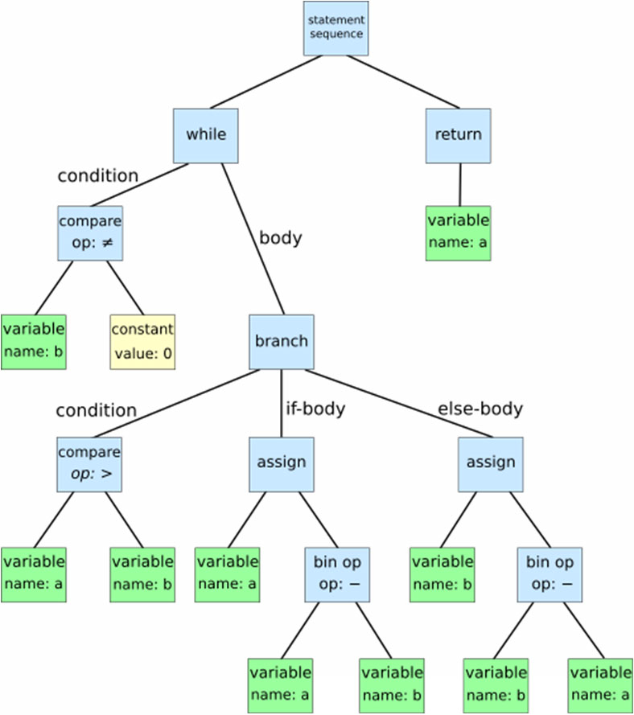

- 利用clang实现ast的输出，具体格式见示例：

  ```
  clang-14 -c -Xclang -ast-dump foo.cpp
  ```

### Quadruple

- 就是“四元组”的意思，形如：`x := y op z`；
- RISC‐V的指令集就是这么定义的，可见Quadruple距离汇编语言近。
- 利用clang实现四元组的输出，具体格式见示例：

  ```
  clang-14 -S -emit-llvm foo.cpp -o foo.ll
  ```

### Directed acyclic graph (DAG，有向无环图)

- 这是AST的化简版，可以减少冗余设计：

  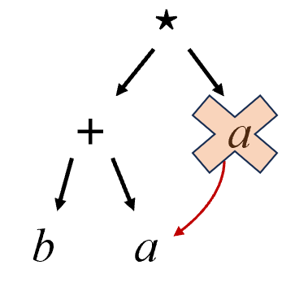

### Control‐flow graph (CFG，控制流图)

- 用来表示控制流信息，每一个节点都是一个**基本区域（basic block）**；

  - 在这个基本区域内，不允许出现跳转语句，都是从一个入口到一个出口。

  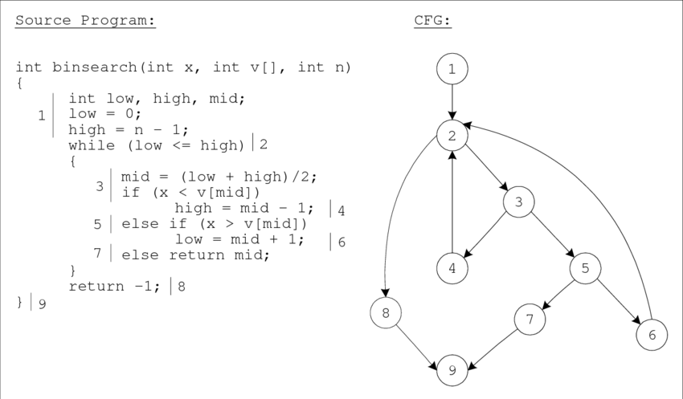
  
- 利用clang 实现CFG的输出，具体格式见示例：

  ```
  clang-14 -Xclang -analyze -Xclang -analyzer-checker=debug.DumpCFG foo.cpp
  ```

### Data‐flow graph（DFG，数据流图）

- 略


## 常见中间语言 —— LLVM language

- 中间语言是中间表示的进阶版，是可以被虚拟机执行的语言。种类有很多，如：Register transfer language (RTL), Java bytecode, LLVM IR(low‐level virtual machine), Microsoft Common Intermediate Language for .NET

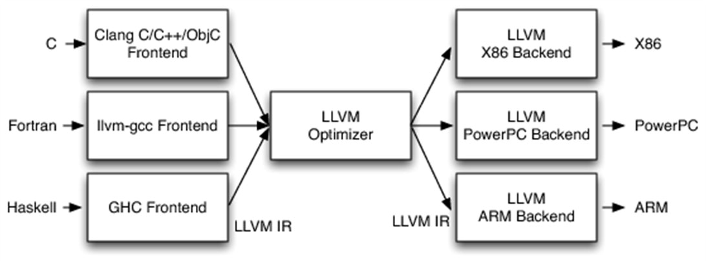

- 可以用四元组的指令查看代码的llvm，形如：

  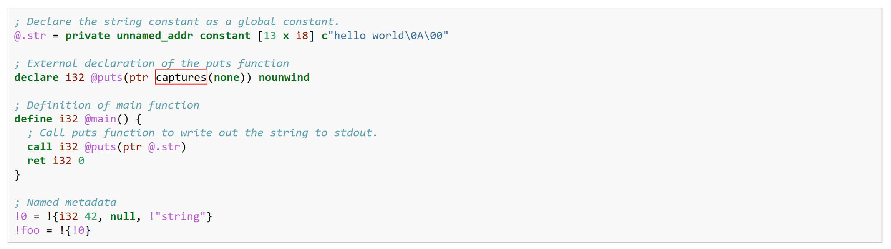

- 类型系统：是强类型的语言
  - Void: `()`
  - Function: `<return type> (<parameter list>)`
  - Integer, Floating(First class): LLVM是底层语法，不支持函数式编程，因此函数不是一等公民。


# Lecture 19: Intermediate Code Generation

- 本节内容讲解如何将不同的中间代码进行转化。

## IR的分级

- High‐level IRs: AST
- Mid‐level IRs: CFG and DAG
- Low‐level IRs: Quadruple and RTL

## 关于变量表(Symbol table)及其作用域的实现

- 变量表的记录：

  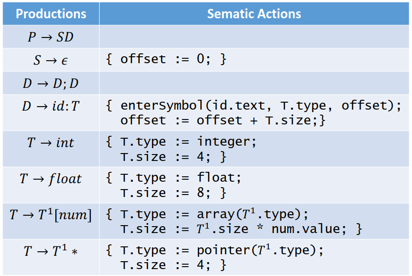

- 引入作用域的处理方式：

  - 首先在作用域前后进行空转移，同时实现语义操作，即实现变量表指针的切换。

  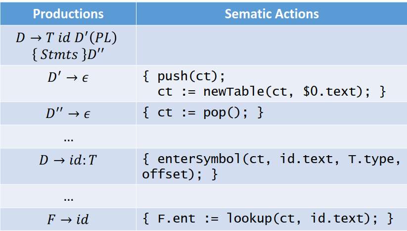

  - 查找的时候从当前的变量表开始，如果无法找到，则向上找到父节点的作用域，以此类推。

    ```
    int foo;
    void bar(int zoo) {
        foo = 1;
        { 
        	int foo;
            foo = zoo + 2;
        }
    }
    ```

  - 一个存在缺失的树状图及其类型表的演示：

    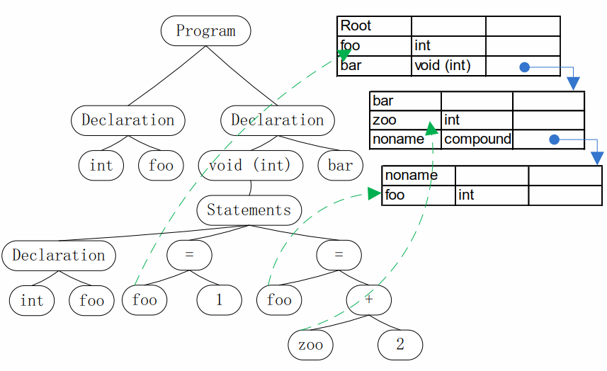


## 中间代码的转换

### 源文件→AST

- 见tutorial。

### 源文件→Quadruple

- 一次性直接转换是可行的，只能说效率比较低。下表中，用emit实现四元组的生成。

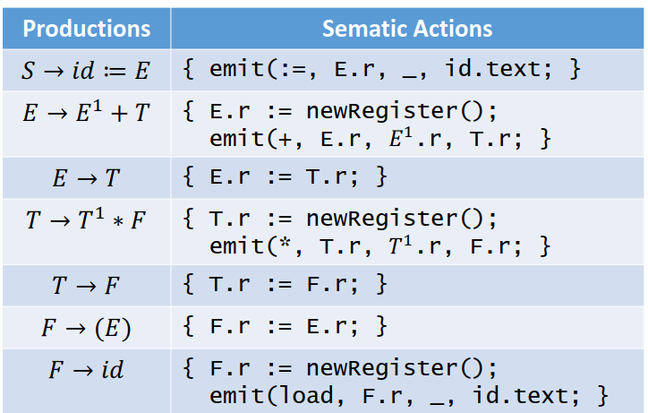

### AST→Typed AST

- 变量类型的获得：

  - 类型综合(Type synthesis)：意味着变量的类型是通过子节点传递上来的；
  - 类型推断(Type inference)：意味着变量的类型是通过平级或者父级传递而来，属于类型的推断。

- Type casting 类型转换：

  - 隐式类型转换(Implicit type casting)：机器自动完成；
  - 显式类型转换(Explicit type casting)：程序员完成。

- 在遍历AST树的时候，会插入强转节点：

  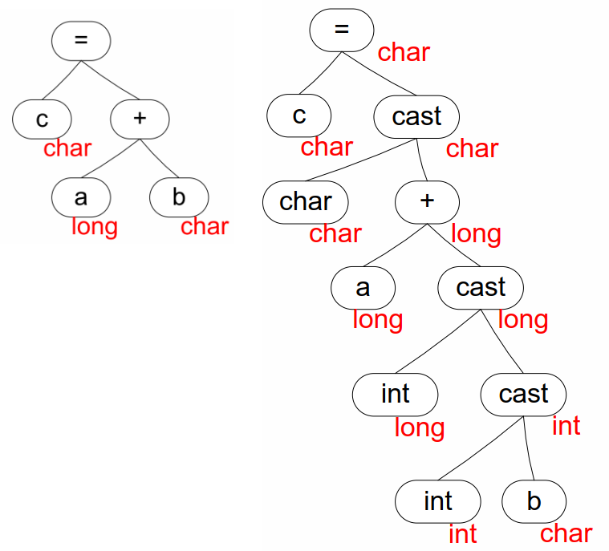

  - `char` 不能直接转换为 `long`，会**先被提升为 `int`**，然后再从 `int` 转为 `long`。

### Typed AST→Quadruples

- 生成顺序代码时的**短路求值**（Short-circuit Evaluation），这是一种惰性求职策略。

- 对布尔表达式：

  - `tentry`：表示布尔表达式为真时的目标标签（branch target）。
  - `fentry`：表示布尔表达式为假时的目标标签（branch target）。

- 对其他常规的表达式(statements)：

  -  `nentry`：标识控制流中的**下一个语句**，即在条件判断后，接下来应该执行哪条语句。

- 直观理解：

  - **前序遍历**：控制流相关的标签（`tentry`、`fentry`、`nentry`）。这些标签对代码的跳转至关重要，需要在代码生成之前设置好，确保正确的跳转逻辑。
  - **后序遍历**：是生成四元式的阶段，因为只有在子树的节点（即子表达式）都处理完成并有了结果时，才能生成正确的四元式操作

  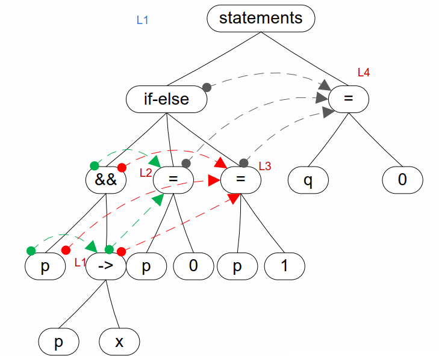


# Lecture 20：Introduction of Program Analysis


## 程序分析的相关概念

### 程序分析的意义

- 程序的问题不可避免；

- 程序的错误成本会随着阶段的递进指数级增长；

  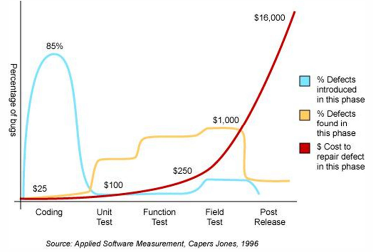

### 程序分析的特征

- 静态方法，不需要跑程序（run program），理解为从代码表面上进行观察，但不会深究代码含义；

### 程序分析的应用

- 程序的优化；消除冗余/不必要的计算；
- 验证：查找程序中的错误；
- 安全：隐私泄露、漏洞检测；
- 程序理解和转换：在IDE中调用图形，重构和修复（clang不显式支持）

### 程序分析的困难

- 一个定理：没有任何一个程序可以判定所有的程序是否够终止。
- Rice定理：任何**非平凡的**（即不是“每个程序都满足的”或“没有程序满足的”，英文为nontrivial）程序行为特征（例如程序的某种性质、程序是否终止等），都是不可判定的。
  - 可能的疑惑：如果我的程序非常简单，也会不可判定吗？ 答案是当然可以判定，但是总有用户故意，或者有大量外部调用的复杂程序，是不能判定的。
  - 证明略。
- **不可判定性问题是程序分析的最大困难**：在实际的程序分析中，尤其是静态分析中，我们常常希望能够自动化地理解程序的行为，例如判断程序是否会终止，是否有潜在的错误，或程序是否符合特定的规范等。然而，这些任务本质上是不可判定的，无法通过一个程序来判断所有程序的行为。**也就是说检查程序覆盖不到的情况的情况。**

### 程序分析的要求

- 可靠性（soundness）：分析工具做出的每一个声明（即结论）都必须是真实的。
- 完备性（Completeness）：工具必须能够检测到所有正确的属性，不能遗漏任何一个真实的情况。
  - 因为不可判定性问题，这一要求很难完整实现。
- 二者是一个trade-off，因此需要折中（也称做近似，approximations）。


## 如何利用工具实现程序分析

- 正常编译：`clang-14 -c file.cpp`，例如编译器不会对除零的问题报错，只会给出警告，而且分析能力有限：

  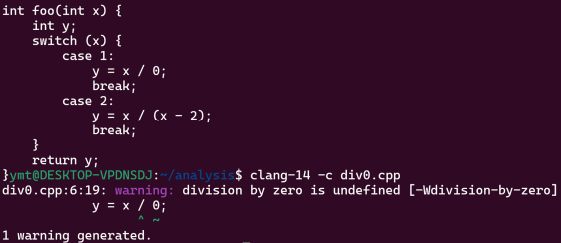

- 利用clang的静态分析器(Static Analyzer)：`clang-14 --analyze file.cpp`，这样编译器会深入分析相关的问题，当然耗时也相应长：

  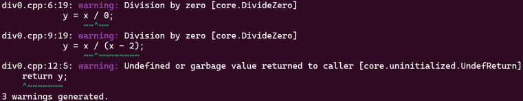

  - 静态分析器可以实现上下文敏感（context-sensitive）和跨程序分析（inter-procedural analysis）。
  - clang的checker官网：https://clang.llvm.org/docs/analyzer/checkers.html

  

## 常见的程序分析任务及其应用

### 数据流分析（Data flow analysis）及到达定义（Reaching definitions）

1. 数据流分析：数据流分析主要关注如何在程序中传播和变化，尤其是变量的值如何在不同的语句和函数之间流动。通过这种分析，可以了解程序执行过程中的数据依赖关系。

2. 到达定义：**定义**指的是变量的值被赋值或修改的地方。一个变量的定义**到达**某个语句时，意味着在从某个位置到达这个语句的路径中，该变量没有被重新定义。

3. 应用列举：

   1. 死代码消除（Dead code elimination）：通过数据流的分析，可以知道哪部分代码不会被用到，因此可以删去；

   2. 常量传播（Constant propagation）：通过数据流的分析，如果程序中某个变量的值在某个点上是常量，工具可以在程序的后续部分用这个常量代替变量。

   3. 复制传播（Copy propagation）：复制传播是指程序中一个变量的值通过赋值传递给另一个变量。这种分析可以帮助我们消除不必要的变量赋值，优化代码。

      比如，程序中有 `x = y`，后面代码有 `z = x + 1`，通过复制传播，工具可以把 `x` 替换为 `y`，使得代码变成 `z = y + 1`。

   4. 检测未初始化的变量（Detecting uninitialized variables）：未初始化变量指的是在使用之前没有赋值的变量。未初始化的变量使用可能会导致程序的错误或不确定行为。

### **活跃变量分析（Live variables analysis）**

- 活跃变量指的是那些在程序的某个点上，会在后续的执行中被使用的变量。换句话说，一个变量在程序中的某个点是“活跃”的，意味着该变量的值在之后的计算中仍然会被用到，或者它的值影响着后续的执行。

- 应用列举：
  - 寄存器分配（Register allocation）：如果一个变量在某个时刻是活跃的，那么编译器就需要将其放入一个寄存器中，确保该变量在后续的操作中可以被快速访问。
  - 垃圾回收（Garbage collection）：如果一个对象在程序的某个点之后不再被使用，它就可以被视为垃圾，可以被回收。
  - 指令调度（Instruction scheduling）：目的是重新排序指令，以提高程序的执行效率。
  - 死代码消除（Dead code elimination）

### 指针分析（Pointer analysis）

- 指针分析用于确定程序中**指针**可能指向的变量或存储位置。指针分析的目标是确定程序中的指针变量在哪些位置、哪些对象或内存地址上有可能指向，以便分析程序的行为和数据访问模式。
- 指针分析需要在精度和效率之间做平衡。为了提高效率，很多指针分析技术可能会忽略一些细节（如上下文敏感性和流敏感性），这可能会牺牲一定的精度。
  - **上下文敏感性(Context Sensitivity)**：例如，假设有一个函数 `foo`，它在不同地方被调用，且传入的参数不同。在上下文敏感的分析中，`foo` 在不同调用位置的行为会被区分开来。
  - **流敏感性 (Flow Sensitivity)**：例如，如果一个变量 `x` 在某个条件判断后被赋值为 10，流敏感分析会根据程序路径的不同而考虑不同的 `x` 值。
- 应用列举：
  - **数据竞争检测（Data race detection）**：数据竞争发生在多个线程对共享数据进行读写，且没有适当的同步机制的情况下。指针分析有助于识别程序中哪些共享变量可能存在数据竞争，尤其是在多线程程序中。
  - **别名分析（Alias analysis）**：**别名**指的是两个不同的指针变量可能指向同一个内存位置。别名分析有助于识别程序中指针可能指向相同内存的情况，从而优化程序或避免潜在的错误。
  - **逃逸分析（Escape analysis）**：逃逸分析用于确定一个对象或内存区域的引用是否会“逃逸”到方法或函数之外。逃逸分析有助于决定是否可以对某些对象进行内存分配优化（如栈上分配而非堆上分配），从而提高性能。
  - **精确的控制流图（Precise control flow graphs for binaries）**：在程序的控制流图中，指针分析通常依赖于精确的控制流图来确定指针在不同执行路径上的值。例如，在 `if` 或 `loop` 语句中，指针的值可能会不同，取决于程序的执行路径。没有精确的控制流图，指针分析无法准确地跟踪指针在每个路径中的行为。
  - **控制流完整性（Control-flow integrity）**：检测程序中的恶意修改，确保程序的控制流符合预期。指针分析可以帮助验证程序中的跳转指令（如函数指针）是否被篡改，从而保护程序免受攻击。
  - **污点分析（Taint analysis）**：污点分析用于追踪程序中不可信的数据源（即“污点”）如何传播到程序的其他部分。指针分析在污点分析中用于识别哪些变量或数据结构是可能传播污点的，从而检测潜在的安全漏洞。


# Lecture 21：Reaching Definitions


## 完整实现流程演示

1. 将代码转换为CFG，并且为赋值语句增加标号：

   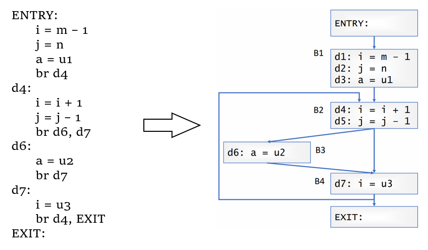

2. 求解每个$block$对应的$gen$和$kill$集合

   1. $gen_s = \{ s \}$：$s$代表statement语句，这里只需要记录标号即可；
   2. $kill_s = \{ p \mid p \neq s \text{ and } \text{statement } p \text{ defines variable } v \}$：理解为在$s$语句外，任何同样定义变量$v$的语句，注意：这里不考虑执行顺序，一律机械地判定；
   3. 将对单语句的集合拓展到block：$gen_B = \bigcup_{i=1}^{n} gen_{s_i}$及$kill_B = \bigcup_{i=1}^{n} kill_{s_i}$；

   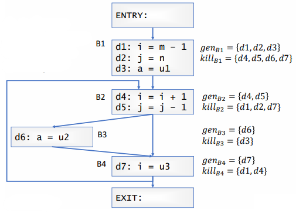

3. 利用算法实现不动点求解：

   1. 算法原型如下：

      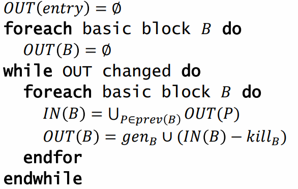

   2. 对$IN$，$OUT$集合定义的解释：

      1. $IN$集合：将所有可能抵达的块$OUT$求取并集；
      2. $OUT$集合：实现类似函数的功能，简记“先减$kill$后并$generate$”；
      3. 注意顺序：对任何一个$block$都是先$IN$后$OUT$，再分析下一个$block$。

   3. 表示方法：为了方便，引入bit vector，值为$1$代表定义可以到达，值为$0$代表定义不能到达。

   4. 举例：

      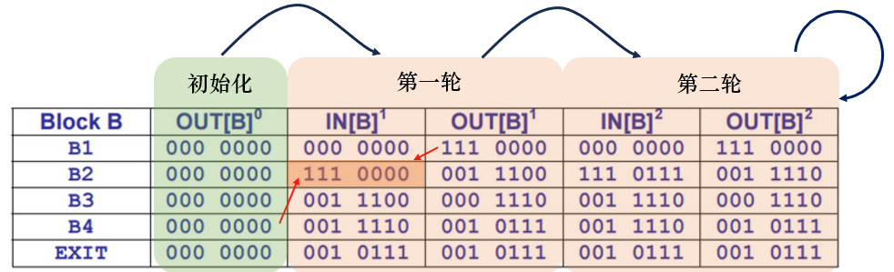


## 相关理论支持

### 相关概念

- **数据流分析**
  - 节点（vertex）代表一个 基本块；
  - 边（edge）代表块之间**可能**的进度；
  - 到达定义可以理解为代码的一个属性，可以通过数据流分析得到。

- **数据流方程**（Data flow equation）
  - 对每一个基本块，$IN和OUT$就是数据流方程；
  - 对于任何基本块，根据求解的方向不同分为forward和backward两种方案，上面的流程是forward类型的。
  - 我们无法直接代入解方程，因为$ IN$ 和$ OUT$相互依赖。所以我们用**迭代法**，逐步逼近最终结果，直到不再变化（达到**不动点**）。
- **数据流值**（Data flow values）
  - 意思是IN和OUT集合的元素数据类型是什么；
  - 正常情况下，{ ( v, p ) | v is defined at statement p. }；
  - 由于一个语句只定义了一个变量，因此可以简化为{ p | p defines a variable that reaches this statement. }；

### 不动点问题（Fixed-point problem）

- 分析$IN$和$OUT$之间的关系：
  - 根据算法，我们只需要不断更新 $OUT$，$IN $自然就能跟上；
- 迭代逻辑：
  - 我们定义一个点：$x = (OUT(B_1), OUT(B_2), ..., OUT(B_n))$
  - 然后通过一个函数 $f$ 来不断更新它：$x^{i+1} = f(x^i)$
  - 其中，$OUT^{i+1}(B) = (IN^{i+1}(B) - kill_B) \cup gen_B$，$IN$也可以表示为$OUT^i(B)$，所以相当于只有$OUT$在迭代。
- Knaster-Tarski 定理：解释为什么这个过程**一定会停**，而且解是正确的


# Lecture 22: Live Variable Analysis

## 完整实现流程演示

1. 将代码转换为CFG，并且为赋值语句增加标号：

   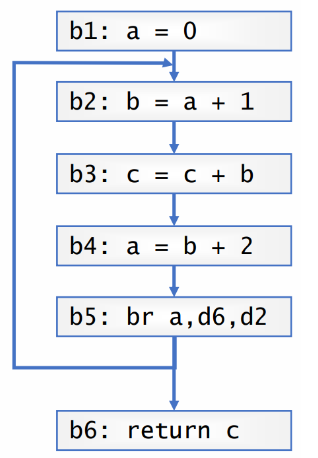

2. 求解每个$block$对应的$use$和$def$集合

   1. $def_s = \{x | x\ is\ defined\ in\ s\ and\ x\  wasn't\ used \ before \}$：$s$代表$statement$语句；
   2. $use_s = \{x | x\ is\ used\ in\ s\ and\ x\  wasn't\ defined\ before \}$：把可能消耗掉的定义进行记录；
   3. 将对单语句的集合拓展到block：$use_B = \bigcup_{i=1}^{n} use_s$及$def_B = \bigcup_{i=1}^{n} def_s$；

   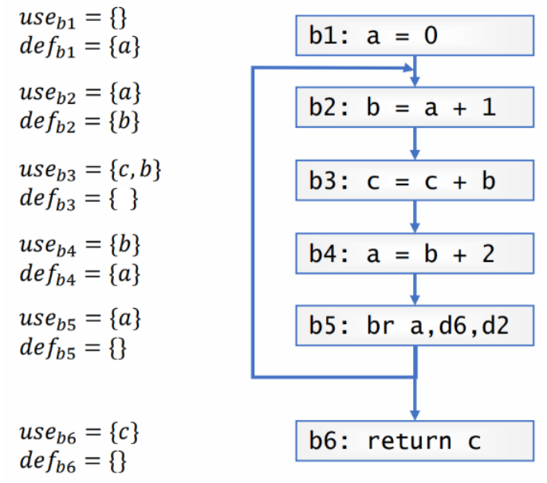

3. 利用算法实现反向求解：

   1. 算法原型如下：

      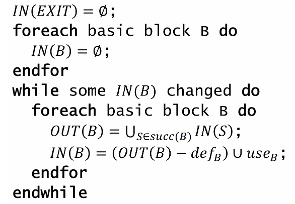

   2. 对$IN$，$OUT$集合定义的解释：

      1. $IN$集合：实现类似函数的功能，简记“先减$def$后并$use$”；
      2. $OUT$集合：将后一步可能运行到的$IN$集合求取并集；
      3. 注意顺序：对任何一个$block$都是先$OUT$后$IN$，再分析下一个$block$。

   3. 举例：

      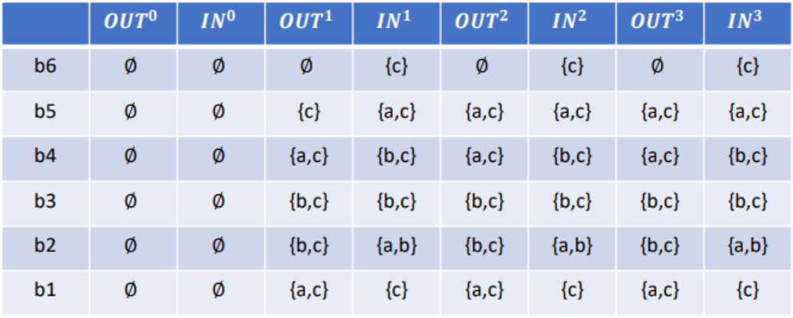


## 相关理论支持

### Live Variable Analysis 概述

- 活跃变量分析（Live Variable Analysis）是一种重要的数据流分析技术，用于确定在程序的每个点上，哪些变量在未来的执行中可能被使用。一个变量在某点是"活跃的"，如果它的当前值可能在该点之后的某个地方被使用。

### 主要应用

- 寄存器分配：只能实现对没有活性的变量寄存器重分配；至于寄存器存储的变量都有活性，则需要寄存器分配策略；
- 死代码消除；
- 程序切片；
- 程序理解和调试；

### 活跃变量的性质

如果变量 v 在程序点 p 是活跃的，那么：

1. 存在一条从 p 到使用 v 的路径
2. 在该路径上，v 在被使用前没有被重新定义

### 活跃变量方程

1. **语句级别的方程**：
   - IN(s)，OUT(s);

2. **基本块级别的方程**：
   - IN(B)，OUT(B);

### 不动点计算

Live Variable Analysis 使用迭代算法计算不动点，即当所有 IN 集合不再变化时的状态。算法保证在有限步骤内收敛到不动点，因为：

1. 格（lattice）是有限的（变量集合是有限的）
2. 传递函数是单调的（集合只会增大，不会减小）
3. 合并操作（并集）是可交换和可结合的


## Live Variable Analysis 与 Reaching Definitions 的对比

### 分析方向

- **Reaching Definitions**：前向（forward）分析，从程序入口向出口方向传播信息
- **Live Variable Analysis**：后向（backward）分析，从程序出口向入口方向传播信息

### 初始化差异

- **Reaching Definitions**：OUT集合初始化为空集；
- **Live Variable Analysis**：IN集合初始化为空集；

### 数据流方程对比

**Reaching Definitions**：

- $OUT(B) = gen_B ∪ (IN(B) - kill_B)$
- $IN(B) = \bigcap _{P∈pred(B)} OUT(P)$

**Live Variable Analysis**：

- $IN(B) = (OUT(B) - def_B) ∪ use_B$
- $OUT(B) = \bigcap _{P∈pred(B)} IN(S)$

### 结果解释对比

- **Reaching Definitions** 的结果告诉我们：
  - 哪些定义可能到达程序的某个点
  - 变量的值可能来自哪些赋值语句

- **Live Variable Analysis** 的结果告诉我们：
  - 在程序的某个点，哪些变量在未来可能被使用
  - 哪些变量的当前值对程序的未来执行是重要的

- 总的来说，Reaching Definitions 关注的是"过去"（变量的定义来自哪里），而 Live Variable Analysis 关注的是"未来"（变量的值将在哪里被使用）。这种互补性使得这两种分析在编译器优化中经常一起使用。


# Lecture 23: Local Optimizations


## 优化的概念

- 优化指的是编译器在生成代码时为了提高程序性能、资源利用、能效或安全性而执行的一系列处理过程。

- 分类：

  - **Local Optimization（局部优化）**：针对单个基本块中的操作进行优化，通常不依赖全局信息。
  - **Global Optimization（全局优化）**：这种优化跨越多个基本块，考虑整个程序或函数中的操作。它的目标是优化全局的数据流、内存使用或控制流。
  - **Interprocedural Optimization（跨过程优化）**：跨过程优化在不同函数之间进行，旨在改进跨函数的性能。
  - **Link-time Optimization（链接时优化）**：这种优化在链接阶段进行，能够对整个程序的各个部分进行优化。

- 在编译过程中，编译器会执行多个优化阶段（passes），这个一般串行的，也存在路径的循环，以便于彻底优化。可以执行`opt -O2 -S -print-pipeline-passes foo.ll`查看

  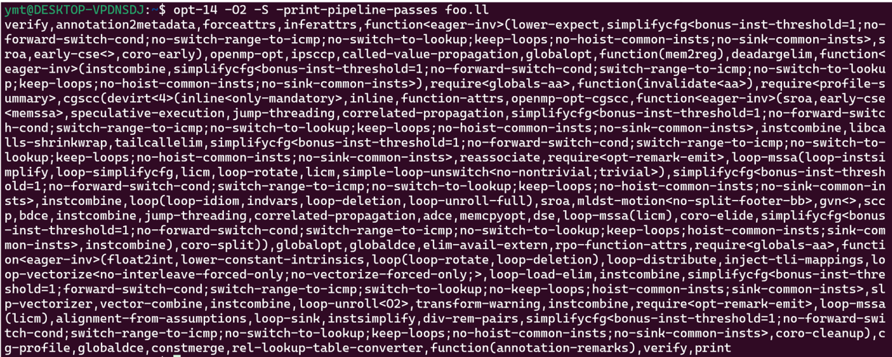

## 本地优化的几种策略

### Strength reduction（强度折减）

- 用来将“贵”的运算替换为“便宜”的运算，比如把整数乘法转换为加法和移位。
- 例如：`x * 17 ⟹ (x << 4) + x`；

### Constant folding（常量折叠）

- 在编译的时候进行常量的运算。
- 例如：`2 * 2 ⟹ 4`、`2 * 2 ⟹ 4`；

### Constant propagation（常量传递）

- 如果一个变量被定义为常数，则可以替代所有这个变量的使用。

- 显而易见，常量传递和常量折叠是循环优化的：

  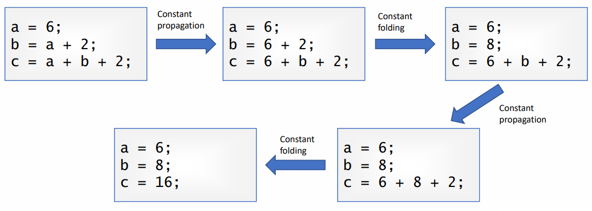

### Dead code elimination（死代码消除）

- 指的是哪些不会再被使用的代码。
- 例如：`c = 1; c = 2; ⟹ c = 2; ` 、`let a = 1 in 2 ⟹ 2`；

### Copy propagation（复制传递）

- 在常量传递的基础上，引入了变量的传递。

- 例如：理论上可以在源代码层进行优化，但是因为优化大多数发生于LLVM底层的中间代码，下图展示汇编层的优化策略。

  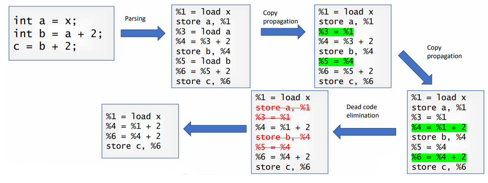

### Static single‐assignment form (SSA)

- 要求每个变量只能被赋值一次，可以进一步消除死代码。

- 例如：

  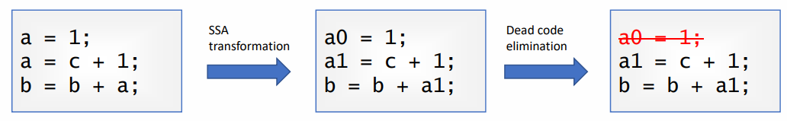

  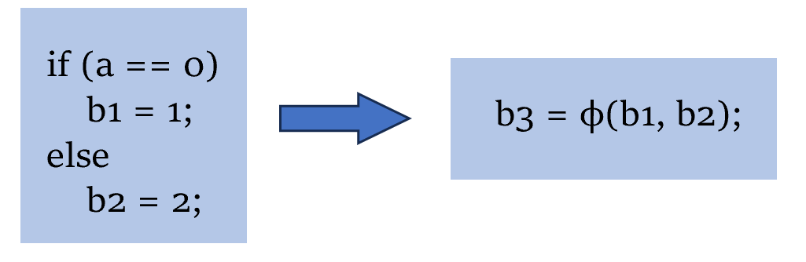


# Lecture 24: Global Optimizations


- 全局优化着眼于CFG块之间的逻辑关系，一般情况下，在本地优化后执行。

## Global Common Subexpressions（全局通用子表达式）

- 目的：希望尽可能避免出现重复计算，这被称之为**“消除通用子表达式”**。

- 举例：

  ```c
  a = b + c;     #{a = b + c}
  d = b + c; -> d = a;    #{a = b + c}
  d = e * 2;     #{a = b + c, d = e * 2}
  b = c + 6;     #{d = e * 2; b = c + 6}
  ```

- 如：$a=b+c$，则$gen_s=\{s\}$；$kill_s = \{exp\ |\ exp\ uses\ a\}$ 

- $OUT(s) = (IN(s) \cup gen_s)-kill_s;$ 可见顺序为“先增后减”，原因可以考虑$a = a +1 $的表达式；

- $IN(B) =  ⋂_{P\in pred(B)} OUT(P)$，这里是交集，是根据特定问题而言的。

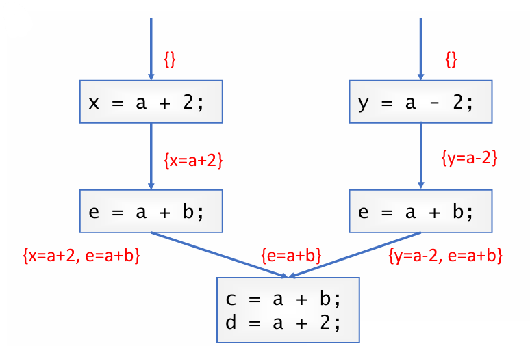

## Loop Optimizations

### Loop unrolling

```c
const int N = 4;
int a[N], b[N];

void foo() {
    for (int i = 0; i < N; ++i)
        a[i] = b[i] + 1;
}
```

- 替换为，需要注意sw的位置，是因为指令流水线。

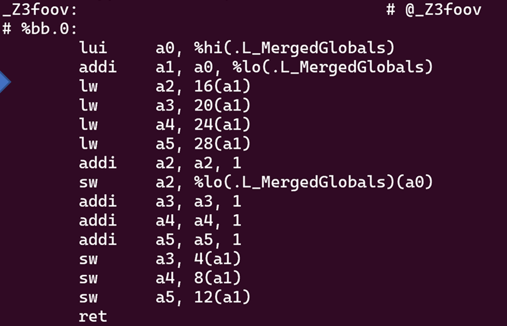

### Loop fusion

- 优势：

  - **减少控制流指令**：通过减少循环条件判断等控制流指令的数量，程序的执行效率会提高。

  - **提高并行性**：合并后的单一循环更容易在多核处理器上并行执行，能够提高处理效率。

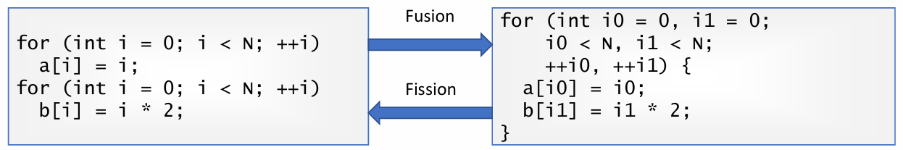

### Loop fission

- 优势

  - **改善数据局部性**：小循环可以更好地利用缓存，减少内存访问的开销，提高效率。

  - **多核优化**：多个小循环可以并行化执行，在多核处理器上运行时能够充分发挥其性能。

### Loop tiling**(循环切块)** 

- 目的：通过改变嵌套循环的迭代顺序，来改善缓存的性能。
- 例如：假设有一个简单的矩阵-向量乘法运算，我们要计算 $C = A \times B$，其中 A 是矩阵，B 是向量，C 是结果向量。对于一个简单的实现，可能会有如下的嵌套循环：

```c
void matvec_multiply(double A[N][N], double B[N], double C[N]) {
    for (int i = 0; i < N; i++) {
        C[i] = 0;
        for (int j = 0; j < N; j++) {
            C[i] += A[i][j] * B[j];
        }
    }
}
```

```c
void matvec_multiply_tiled(double A[N][N], double B[N], double C[N]) {
    for (int i = 0; i < N; i++) {
        C[i] = 0;
    }

    // 外层循环使用 Tile
    for (int i = 0; i < N; i += TILE_SIZE) {
        for (int j = 0; j < N; j += TILE_SIZE) {
            // 内层循环计算块内的乘法
            for (int ii = i; ii < i + TILE_SIZE && ii < N; ii++) {
                for (int jj = j; jj < j + TILE_SIZE && jj < N; jj++) {
                    C[ii] += A[ii][jj] * B[jj];
                }
            }
        }
    }
}
```


### Loop invariant removal **(循环不变式移除)** 

- 目的：旨在通过将循环中不变的操作移出循环体，从而提高程序的执行效率。
- 一个语句（例如 `x = a + 4;`）如果在循环体内没有依赖于循环变量 `i`（即每次循环时结果都一样），则它被认为是一个 **循环不变式**。

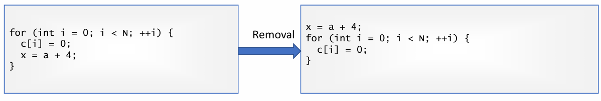


# Lecture 25: Runtime organization


## Application Binary Interface (ABI, 应用二进制接口)

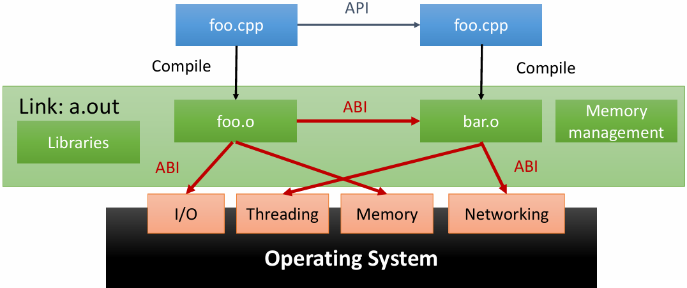

- 定义：两个二进制模块之间的接口，区别于API。

- 调用惯例（Calling convention）：

  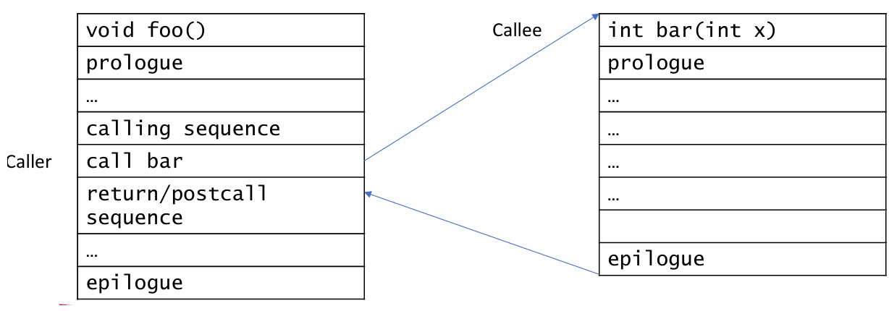

  1. prologue：压栈保存调用者寄存器，并且分配新的栈区；
  2. epilogue：释放栈区，弹栈恢复调用者寄存器，返回；
  3. calling sequence：调用序列，用于提供调用的准备，如部分寄存器的保存，以及参数的传递。
     - 特别地，在riscv系统中，如果参数较少，存放在$a_0-~ a_7$或$fa_0 - fa_7$中，较多则通过指针传递。调用者需要自己保存$t_0-t_6$和$ft_0-ft_6$这些临时寄存器。


## Memory organization

### 概览

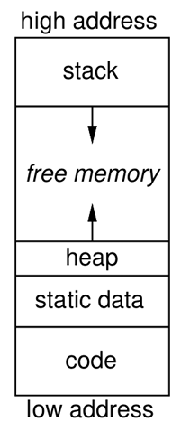

- 上述进程映像，现代内存管理的任务是编译器和操作系统共同完成的，在存储上一般采用分段式存储，比如.data段，.bss段等。

### 静态数据区

- 全局变量、静态变量存储于此。
- 这些变量可以在编译的时候确定相对于static data段首的偏移地址，在链接的时候会被直接分配到一个具体的物理地址。

### 栈区

- 为什么局部变量不能放置在静态数据区？
  - 因为函数调用的顺序和次序不能确定。
- 尽管栈区的地址不能确定，但是在栈内的偏移地址是确定的。

### 堆区

- 用户管理堆：如C语言中的malloc和free，可能导致各种内存泄露。
- 自动管理堆：涉及下一讲GC垃圾回收的问题，可能导致性能问题。


# Lecture 26: Garbage Collection

## GC概念

### 引入GC的原因

引入垃圾回收（Garbage Collection）的主要原因是用户管理堆内存容易出错。下例展示了用户管理堆内存时可能出现的两种常见错误：

1. **双重释放（Double free）**：当同一块内存被释放两次时，会导致程序崩溃或不可预测的行为。
2. **内存泄漏（Memory leak）**：当程序不再使用某块内存但未释放它时，这块内存就无法被重新利用，导致程序随着时间推移消耗越来越多的内存资源。

示例代码展示了这些问题：

```cpp
class List {
    List *next;
    List() {
        next = nullptr;
    }
};

void foo() {
    List *p = bar();
    …
    delete p; // 双重释放！
} 

List *bar() {
    List *h = new List();
    h->next = new List(); // 内存泄漏！
    p = h;
    …
    delete p;
    …
    return h;
}
```

- 这些内存管理错误难以调试且可能导致严重的程序问题，因此需要一种自动化的内存管理机制来避免这些错误，这就是引入垃圾回收的主要原因。

### GC的概念与特征

垃圾回收（Garbage Collection）是一种自动内存管理机制，其核心概念和特征如下：

1. **定义**：
   - 垃圾回收是一种自动内存管理机制
   - 如果一块内存不再被使用，则称之为"垃圾"（garbage）
   - 垃圾回收器尝试回收已分配但不再使用的内存空间

2. **历史**：
   - 垃圾回收最早在Lisp编程语言中引入
   - 现代许多高级编程语言如Java、C#、Python、JavaScript等都内置了垃圾回收机制

3. **特点**：
   - 不需要用户手动释放内存
   - 自动识别和回收不再使用的内存

4. **优点**：
   - 减少内存错误，如内存泄漏和双重释放
   - 简化程序员的工作，无需手动管理内存
   - 提高程序的健壮性和安全性

5. **缺点**：
   - 运行时开销（run-time overhead）
   - 可能导致程序暂停（在某些GC算法中）
   - 内存使用效率可能不如手动管理

垃圾回收机制通过自动识别和回收不再使用的内存，大大减轻了程序员的负担，同时也减少了内存相关的错误。尽管垃圾回收会带来一定的运行时开销，但在大多数现代应用程序中，其带来的好处远大于这些开销。

## Reference counting （引用计数）方法

### 引入原因

引入Reference counting（引用计数）垃圾回收方法的主要原因是为了解决手动内存管理中的问题，同时提供一种简单直接的自动内存管理机制。Reference counting是最早被广泛应用的垃圾回收技术之一，它通过跟踪对象被引用的次数来确定对象是否可以被安全回收。

### 方法步骤及演示

Reference counting垃圾回收方法的基本原理是为每个对象维护一个引用计数器，记录当前有多少个引用指向该对象。当引用计数降为0时，表示该对象不再被使用，可以安全地回收其占用的内存。

#### 基本步骤

1. **对象创建**：当一个对象被创建时，其引用计数器初始化为1。
2. **引用传递**：每当对象被作为参数传递时，增加该对象的引用计数。
3. **引用赋值**：当执行赋值操作`u = v`时，增加v对象的引用计数，并减少u原先引用的对象的计数。
4. **函数返回**：当函数返回时，减少所有被局部变量引用的对象的计数。
5. **计数为零**：当对象的引用计数降为0时，回收该对象占用的内存。
6. **级联回收**：当一个对象被回收时，减少该对象所有成员对象的引用计数，可能触发级联回收。

#### 演示示例

以下是一个Java风格的示例，展示了Reference counting的工作过程：

```java
class List {
    List next;
}

int main() {
    List h = new List();  // 创建对象h，引用计数为1
    List m = new List();  // 创建对象m，引用计数为1
    
    h.next = m;  // m的引用计数增加到2
    
    List t = new List();  // 创建对象t，引用计数为1
    
    m.next = t;  // t的引用计数增加到2
    
    m = null;  // m对象的引用计数减少到1
    
    t = null;  // t对象的引用计数减少到1
    
}  // 函数结束，h的引用计数变为0，被回收
   // h被回收后，m的引用计数变为0，也被回收
   // m被回收后，t的引用计数变为0，也被回收
```

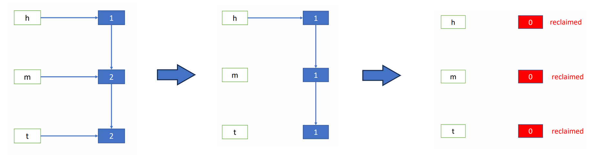

### 优点

1. **增量式操作**：Reference counting是一种增量式的垃圾回收方法，每次引用关系变化时只需要更新相关对象的计数器，不需要暂停程序执行大规模的垃圾回收操作。
2. **实时性**：当对象不再被使用时（引用计数降为0），可以立即回收其内存，而不需要等待下一次垃圾回收周期。
3. **实现简单**：相比其他垃圾回收算法，Reference counting的实现相对简单直接，容易理解和维护。
4. **可预测性**：内存回收的时机是确定的，发生在引用计数降为0的时刻，使得程序行为更加可预测。

### 缺点

1. **循环引用问题**：Reference counting最大的缺点是无法处理循环引用。如果对象A引用对象B，对象B又引用对象A，即使它们都不再被程序中的其他部分引用，它们的引用计数也不会降为0，导致内存泄漏。
2. **额外存储开销**：每个对象都需要额外的空间来存储引用计数器，增加了内存使用量。
3. **更新开销**：每次引用关系变化都需要更新计数器，在引用频繁变化的程序中可能带来显著的性能开销。
4. **计数器溢出**：在长时间运行的程序中，引用计数器可能会溢出，需要额外的机制来处理。


## Mark-and-Sweep（标记-清除）方法

### 引入原因

Mark-and-Sweep（标记-清除）垃圾回收方法的引入主要是为了解决Reference counting方法无法处理的循环引用问题。在实际应用中，对象之间的循环引用是很常见的情况，这会导致Reference counting方法无法正确回收不再使用的内存。

### 方法步骤及演示

Mark-and-Sweep是一种周期性的垃圾回收方法，它通过从根对象开始遍历所有可达对象，标记活跃对象，然后回收未被标记的对象。

#### 基本步骤

1. **暂停程序**：垃圾回收开始时，需要暂停程序执行（也称为"Stop the World"）。
2. **标记阶段（Marking）**：
   - 确定根集合（root set）：包括**全局变量、静态变量、当前栈帧中的局部变量（当前函数调用线中的全部局部变量）**等。
   - 从根集合开始，递归遍历所有可达对象，并标记这些对象。
3. **清除阶段（Sweeping）**：
   - 遍历整个堆内存，回收所有未被标记的对象。
   - 重置所有存活对象的标记位，为下一次垃圾回收做准备。
4. **恢复程序**：垃圾回收完成后，恢复程序执行。

#### 演示示例

以下是一个Mark-and-Sweep垃圾回收的示例：

```java
List a = List(); // o1 (全局变量)
int main() {
    Object b = new List(); // o2
    …
    foo();
}
void foo() {
    Object c = new List(); // o3
    …
    // 此时执行Mark-and-Sweep垃圾回收
}
```

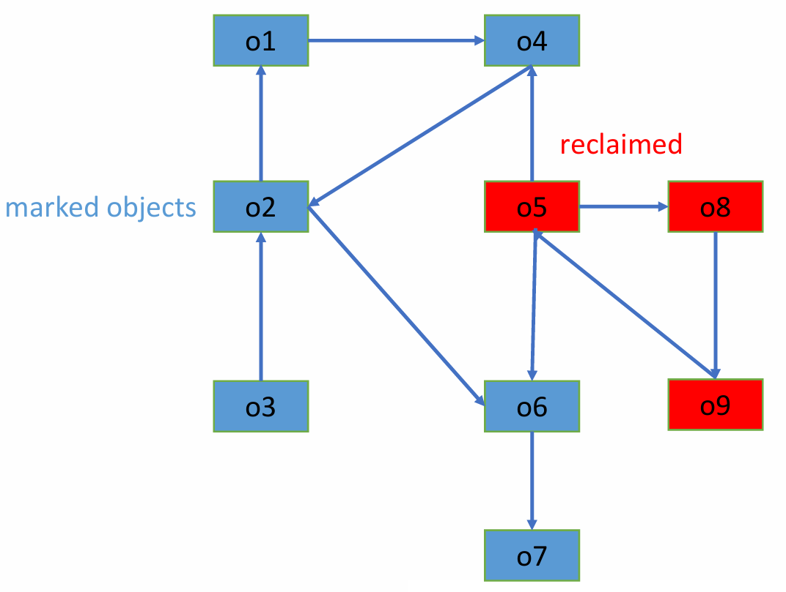

### 优点

1. **能处理循环引用**：Mark-and-Sweep方法可以正确处理循环引用的情况，只要对象不再被根集合可达，即使它们之间存在循环引用，也会被正确回收。
2. **低存储开销**：每个对象只需要一个额外的标记位（1 bit per object），相比Reference counting方法需要的计数器，存储开销更小。
3. **时间复杂度优化**：Mark-and-Sweep的时间复杂度与可达对象的数量成正比，而不是与堆内存中所有对象的数量成正比，这在大多数情况下是一种优化。

### 缺点

1. **程序暂停**：Mark-and-Sweep方法需要暂停程序执行来进行垃圾回收，这会导致程序的停顿，影响用户体验，特别是在实时系统或交互式应用中。
2. **内存碎片化**：清除阶段只是简单地回收未标记的对象，不会整理内存布局，随着时间推移，可能导致内存碎片化，影响内存分配效率。
3. **全堆遍历**：清除阶段需要遍历整个堆内存，在堆内存较大时，这可能导致较长的垃圾回收时间。


## Generational（分代） 方法

### 引入原因

Generational（分代）垃圾回收方法的引入主要基于对对象生命周期的观察和研究。研究表明，在大多数程序中，对象的生命周期呈现出明显的规律：

1. **大多数对象的生命周期非常短**：新创建的对象往往很快就变成垃圾。
2. **存活时间越长的对象，越有可能继续存活**：如果一个对象已经存活了很长时间，那么它很可能会一直存活到程序结束。

这种观察被称为"弱分代假说"（Weak Generational Hypothesis）。基于这一假说，Generational垃圾回收方法被引入，目的是优化垃圾回收的效率，减少程序暂停时间，并提高内存使用效率。

### 方法步骤

1. **内存分代**：
   - 将堆内存分为多个代，通常包括年轻代（Young Generation）和老年代（Old Generation）。
   - 年轻代可能进一步分为Eden区和Survivor区。

2. **对象分配**：
   - 新创建的对象首先分配在年轻代（通常是Eden区）。
   - 当一个代填满时，垃圾回收器会移动到新的代。

3. **垃圾回收策略**：
   - 对年轻代进行频繁的垃圾回收，因为大多数对象在这里很快就会变成垃圾。
   - 对老年代进行较少频率的垃圾回收，因为这里的对象通常有较长的生命周期。
   - 偶尔对整个堆进行全面的垃圾回收，以回收更多的垃圾对象。

4. **对象晋升**：
   - 在年轻代中经过多次垃圾回收仍然存活的对象会被晋升（promoted）到老年代。
   - 晋升的具体策略可能基于对象的年龄（经历的垃圾回收次数）或其他因素。

### 优点

1. **提高垃圾回收效率**：通过将垃圾回收的重点放在年轻代（大多数对象很快就会变成垃圾的区域），可以更高效地回收内存。
2. **减少程序暂停时间**：年轻代的垃圾回收通常很快，而老年代的垃圾回收虽然较慢但频率较低，整体上减少了程序的暂停时间。
3. **适应对象的生命周期特性**：分代策略很好地适应了大多数程序中对象的生命周期特性，提高了内存管理的效率。
4. **可调整性**：可以根据应用程序的特性调整各代的大小和垃圾回收策略，优化性能。

### 缺点

1. **实现复杂**：相比简单的Mark-and-Sweep或Reference counting方法，Generational垃圾回收的实现更加复杂。
2. **内存开销**：需要额外的数据结构来跟踪对象的年龄和代际信息。
3. **跨代引用处理**：当老年代对象引用年轻代对象时，需要特殊的机制（如记忆集、卡表等）来确保正确性，增加了复杂性。
4. **调优难度**：为特定应用程序找到最佳的代际划分和垃圾回收策略可能需要大量的调优工作。


## Copying Collection 方法

### 引入原因

Copying Collection（复制式垃圾回收）方法的引入主要是为了解决Mark-and-Sweep方法导致的内存碎片化问题。

### 方法步骤

1. **内存划分**：
   - 将堆内存分为两个相等大小的半区：From空间和To空间。
   - 在正常运行时，只使用From空间进行对象分配。

2. **垃圾回收过程**：
   - 当From空间填满时，触发垃圾回收。
   - 在From空间上执行类似Mark-and-Sweep的标记过程，标记所有可达对象。
   - 将所有标记的（存活的）对象复制到To空间，同时进行压缩，使得所有对象在To空间中连续排列。
   - 调整所有引用，使其指向对象在To空间中的新位置。
   - 交换From空间和To空间的角色，原来的To空间变成新的From空间，原来的From空间变成新的To空间。

3. **内存分配**：
   - 在新的From空间中分配新对象，由于所有存活对象都被压缩到了空间的一端，分配操作变得非常简单，只需要移动一个指针即可。

### 优点

1. **解决内存碎片化**：通过复制和压缩操作，确保存活对象在内存中连续排列，有效解决了内存碎片化问题。
2. **简化内存分配**：由于存活对象被压缩到内存的一端，新对象的分配变得非常简单和高效，只需要移动一个指针即可。
3. **提高缓存命中率**：连续排列的对象有助于提高CPU缓存的命中率，提升程序性能。
4. **回收效率高**：只需要处理存活的对象，而不是遍历整个堆内存，在存活对象较少的情况下效率很高。

### 缺点

1. **内存使用效率低**：需要预留一半的堆内存作为To空间，实际可用的堆内存只有总内存的一半，这在内存资源紧张的环境中可能是一个严重的问题。
2. **复制开销**：需要复制所有存活对象，当存活对象较多时，复制操作的开销可能很大。
3. **不适合存活率高的场景**：如果大部分对象都是长期存活的，复制操作的开销会很大，效率会降低。


# Lecture 27: Machine code generation


## 后端完整流程概述

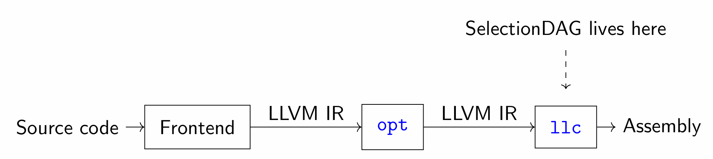

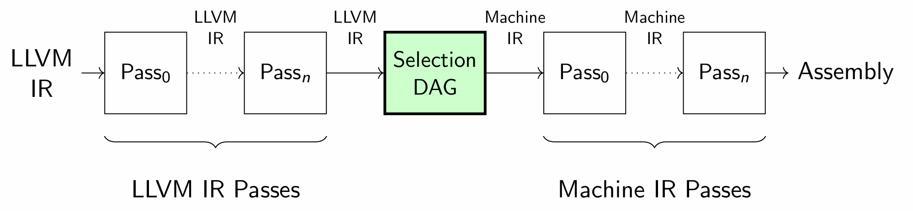

- 在前端转换完成后，LLVM IR会经历opt优化阶段的passes（称为LLVM IR），形成Selection DAG，再经过llc的编译passes（称为Machine IR），逐渐变化为适应特定平台的代码序列。

- 本节的重点是解释llc passes的实现流程：

  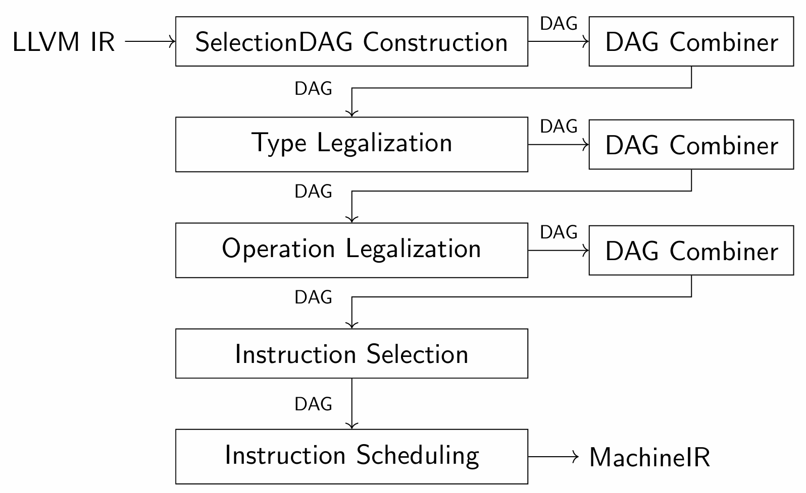

- 相关教程：

  [英伟达工程师LLVM后端讲座]: https://llvm.org/devmtg/2024‐10/slides/tutorial/MacLean‐Fargnoli‐ABeginnersGuide‐to SelectionDAG.pdf

## SelectionDAG Construction

### 相关概念

- ISD：Intermediate Selection DAG

- MVT： Extended Value Type

- SDNode、SDValue、SDUse，SDNode最多有四层：

  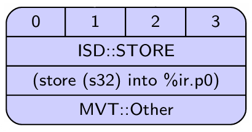

  - 链接层，用于SDUse；
  - 命令层，用于区分不同的指令字段；
  - 命令属性层，解释命令，提供更细致的信息；
  - 类型层，用于显示节点类型。

### 完整实现

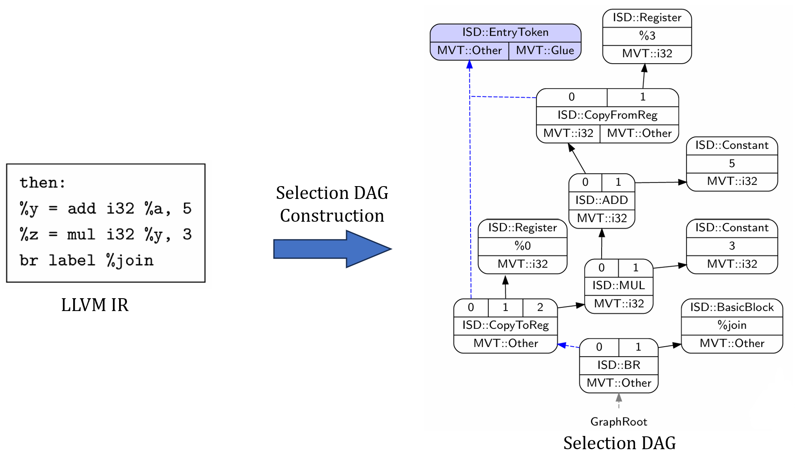

### 显示ISD的命令行方法

```
# 编译到llvm中间代码、
$ clang -S --target=riscv32 -emit-llvm -march=rv32i foo.cpp -o foo.ll
# 形成机器指令
$ llc foo.ll
# 寻找dag的中间形式
$ llc --help-hidden | grep "dag"
# 用graphviz显示，如下
$ llc --view-dag-combine1-dags foo.ll
```


## Type Legalization

- LLVM IR的类型远远大于特定硬件平台的类型，下图展示英伟达PTX（Parallel Thread Execution）的类型支持：

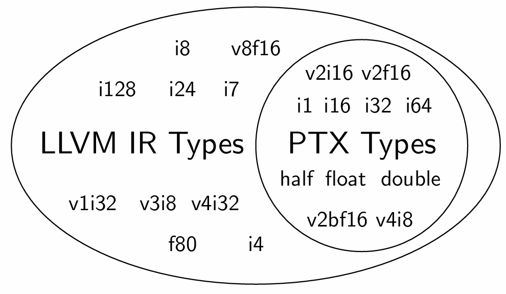

- 例如在某系统中仅支持i32，但是LLVM IR中有i24，所以需要下述转换：

  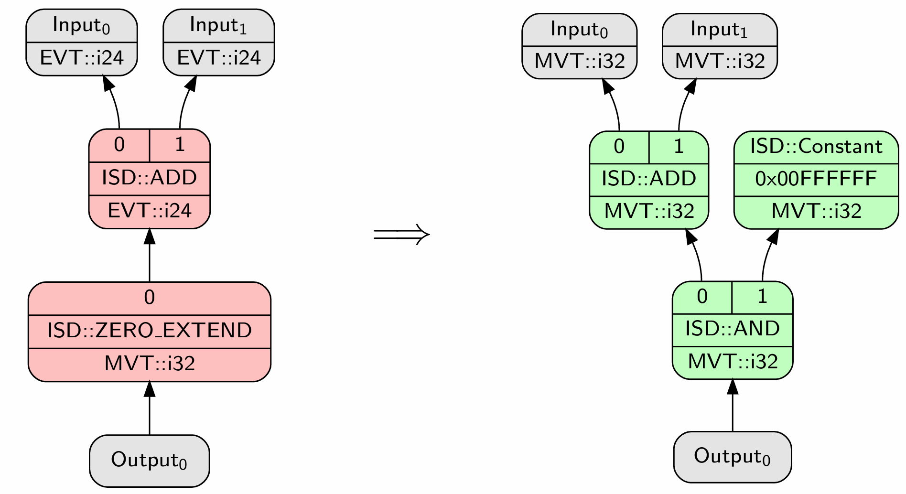

## Operation Legalization

- 不同的系统指令集不相同，需要将LLVM IR的指令进行转化。

- 比如：乘法指令在rv32i中不支持，需要转换成加法、移位等。

  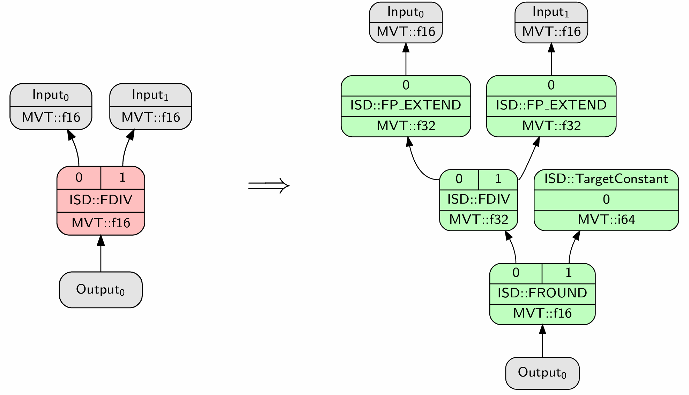

## DAG Combiner

- 需要对DAG定期合并，原因在于每一次调整都可能导致DAG的复杂度变高。

- 例如$a = b + (-c)$可以被转化成$a = b -c$：

  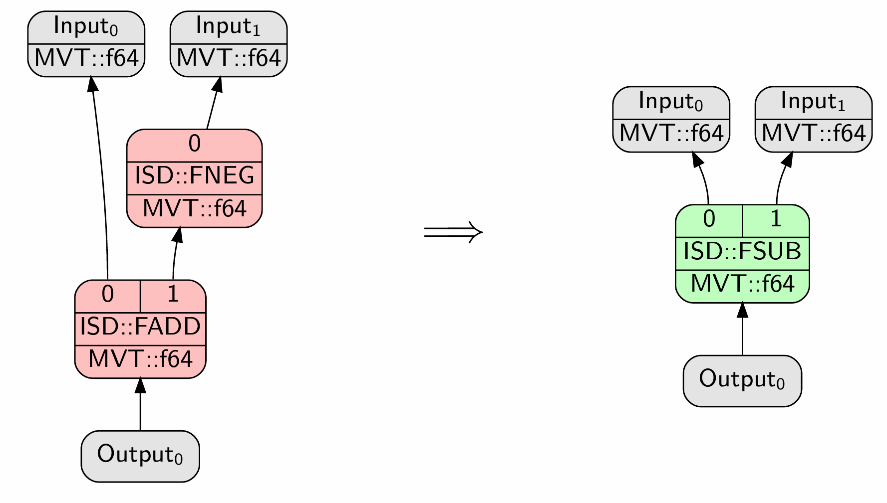

## Instruction Selection

- 指令选择：需要将抽象的指令落实到实际平台。

- 比如将通用的ADD转换为英伟达NVPTX指令集中的ADDi32rr：

  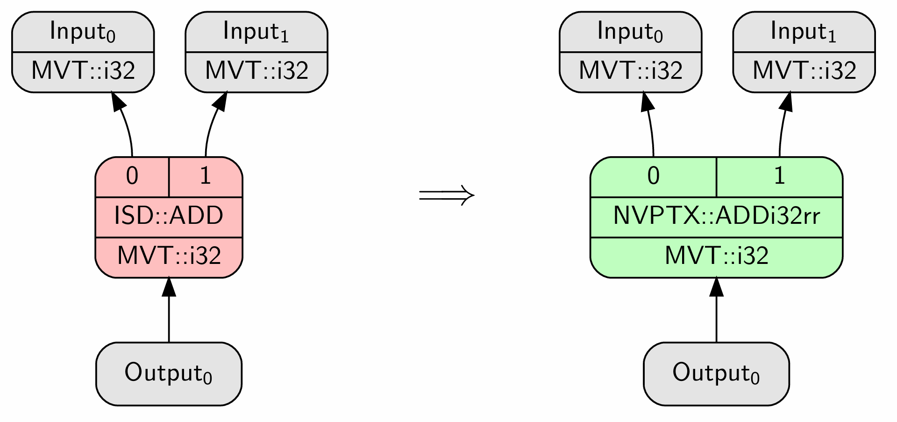

- 如果希望发挥更强大、性能更强的指令，则需要利用“树状匹配”来找到可以优化的指令部分，如下的GPU加乘指令：

  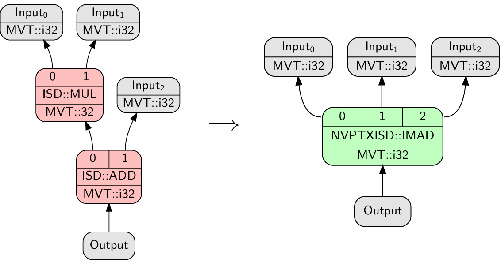

## Instruction Scheduling

- 会综合考虑处理器和核的数量、执行顺序等，生成机器指令的集合。


# Lecture 28: Register Allocation


## 寄存器分配的概念

- 前面已经生成了Machine IR，只剩最后一步将其中的虚拟寄存器转换成真实的寄存器就是完整的机器代码。
- 问题的描述：寻找一个从虚拟寄存器到物理寄存器的对应关系。
- 容易产生的问题：Spilling溢出，如果物理寄存器的数量有限，可能需要将部分寄存器中的数据存放到内存中（spilled back to stack），应该尽可能避免。

## 通过图着色（Graph Coloring）进行寄存器分配

### 概念

- NPC问题，具体P问题、NP问题、NP难问题、NPC问题可见https://blog.csdn.net/xhtchina/article/details/125138413
- 需要启发性（Heuristic）的算法。
  - 启发式算法通常不能保证找到最优解，而是能找到一个相对较好的解。这种方法在解决时间复杂度过高的问题时，通常是妥协选择。
  - 启发式算法依赖于对问题的理解和经验，使用一些规则或启发式判断来引导搜索过程，以期望更快地找到一个满意的解决方案。

- 其他优化导致的问题：Coalescing聚集优化。比如前述的复制传递、通用子表达式消除，可能会导致溢出的问题，因为多个寄存器合并为了一个。

### 算法流程演示

1. 执行活跃性分析（Liveness Analysis）

   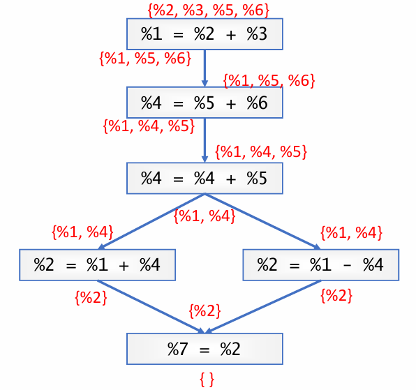

2. 使用活跃性分析的结果构建干涉图G

   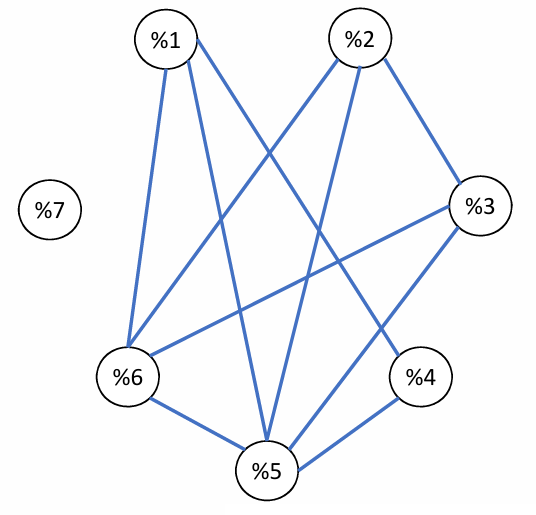

3. 为图的$n$个顶点分配$k$种颜色

   1. 按照边数由多到少的顺序移除顶点及其对应边；

   2. 按照边数由少到多的顺序为相应点着色，如果遇到超过物理寄存器数量的颜色，则用内存load strore指令辅助，重新进行着色。

   3. 本例展示没有溢出的情况：

      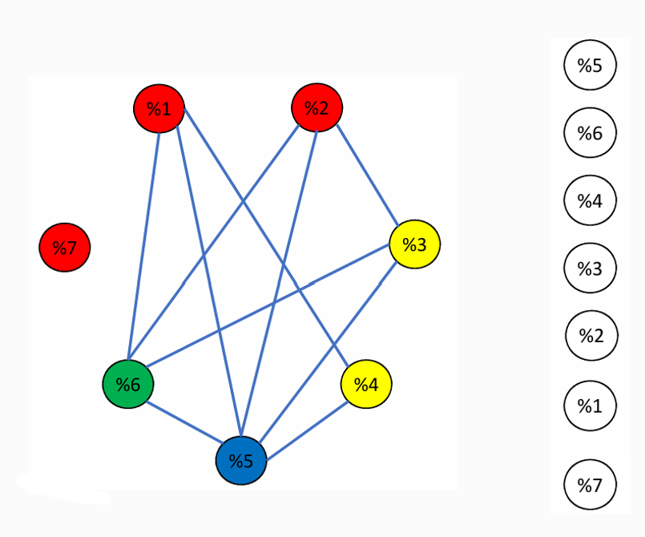

   4. 本例展示仅有三个物理寄存器溢出的场景：

      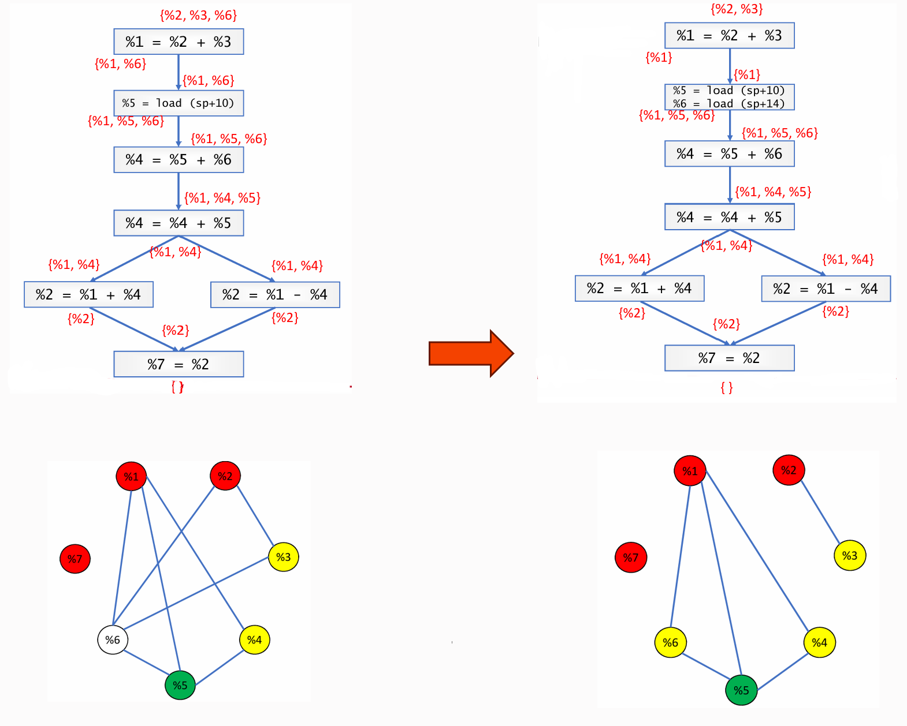

## 通过线性扫描（Linear Scan）进行寄存器分配

- 一个贪心算法，属于启发性算法。

- 活跃区间（live interval）：对于顺序的 IR（中间表示），live interval 是**包含所有 live range**的最小连续子区间，在线性扫描问题中，一般采用这个概念。

- 活跃范围（live range）：指的是程序中某个变量处于“存活”状态（即可能会被读取或使用）的所有位置集合。

- 举例：

  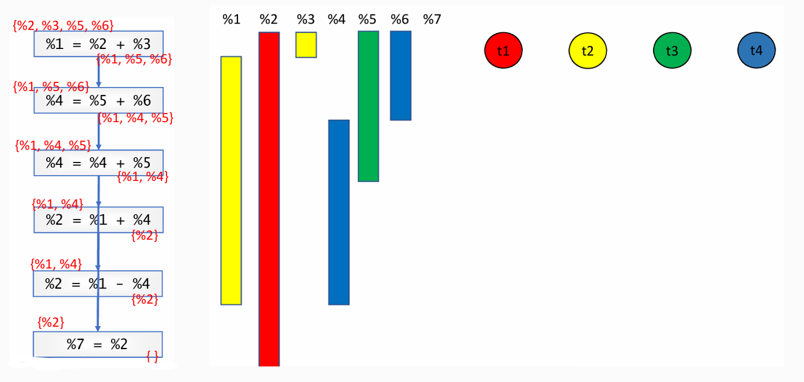

- 上面例子没有溢出的情况，如果存在溢出，则一般根据调度算法确定换回内存的变量是哪个，用来腾出新变量的空间。

## 两种算法的对比

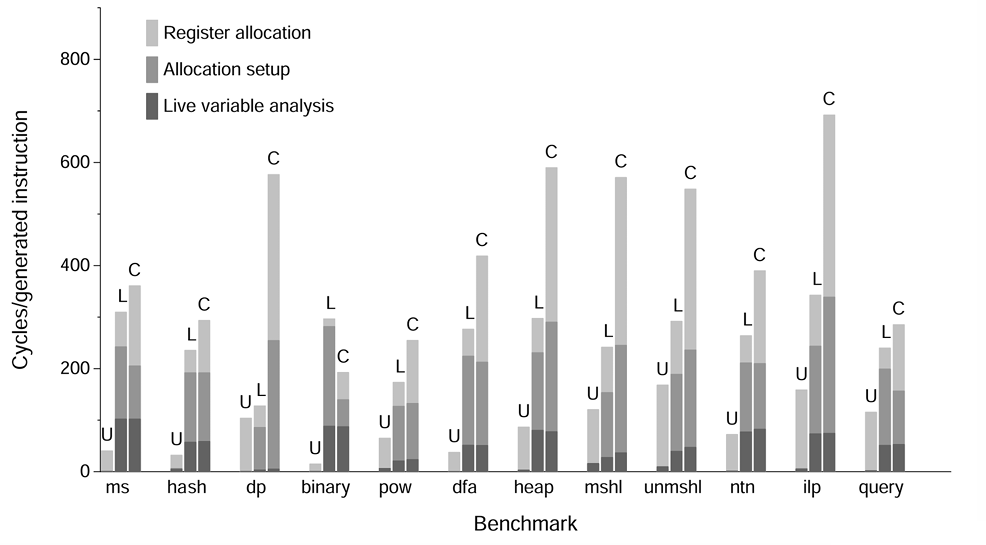

- 可见，线性扫描算法比染色算法具有更好的效果。


# Lecture 29: Modern compilers


## Apache TVM

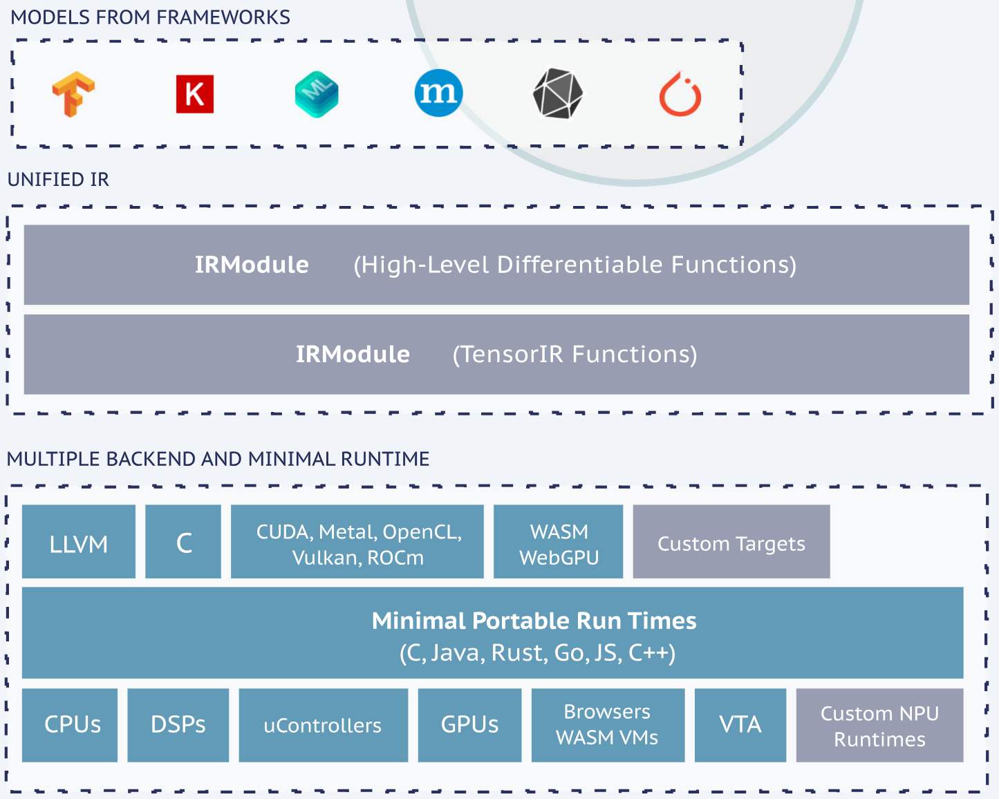

- Apache TVM 是一个开源的端到端机器学习模型编译框架，它的目标是自动将深度学习模型优化后部署到各种硬件设备上，比如 CPU、GPU、移动端甚至 FPGA 和 ASIC。TVM 提供了一个通用的编译器堆栈，用于高效地转换高层神经网络模型（如 TensorFlow、PyTorch、ONNX）到底层代码，自动优化性能并减少手动调优的需求。

```
模型（PyTorch / TensorFlow / ONNX）
         ↓
   Relay 中间表示
         ↓
   图优化 + 自动调度
         ↓
  编译为目标代码
         ↓
部署到 CPU / GPU / 移动端
```


## Xilinx Vitis HLS（High-Level Synthesis）

- 是 Xilinx（现为 AMD 旗下）提供的一种高层次综合工具，用于将 C、C++ 或 SystemC 描述的算法直接转换为可部署到 FPGA（Field Programmable Gate Array）上的 RTL（寄存器传输级）代码（如 Verilog 或 VHDL）。
- **和 Vitis AI、Vivado 生态集成**：
  - 可与 Vivado Flow 配合做 IP 封装，用于更大的系统。
  - 可配合 Vitis AI 将深度学习模型的关键算子 offload 到 FPGA 上。


## TACO（Tensor Algebra Compiler）

- **TACO** 是一个专为稀疏张量运算自动生成高性能代码的编译器框架，全称是 **Tensor Algebra Compiler**。它由 MIT 开发，主要用于线性代数和机器学习中涉及的稀疏张量计算。

- **通用张量代数表达式编译**：

  - 支持高维稀疏张量（如 CSR, COO 等）以及稠密张量。

  - 用户可以用数学表达式描述运算，TACO 自动生成 C/C++ 代码。

- 例如：

  ```taco
  // 表达式：C(i,j) = A(i,k) * B(k,j)
  Format csr = Format({Dense, Sparse});
  Tensor<float> A({m, k}, csr);
  Tensor<float> B({k, n}, csr);
  Tensor<float> C({m, n}, Format({Dense, Dense}));
  ```


## Fully Homomorphic Encryption Compiler (FHE Compiler)

- **FHE 编译器** 是用于将通用程序编译成在**同态加密环境下运行**的程序。它们的目标是：

  - 让用户在**不解密数据的前提下执行计算**。

  - 支持如机器学习推理、数据库查询等在加密数据上的安全操作。
